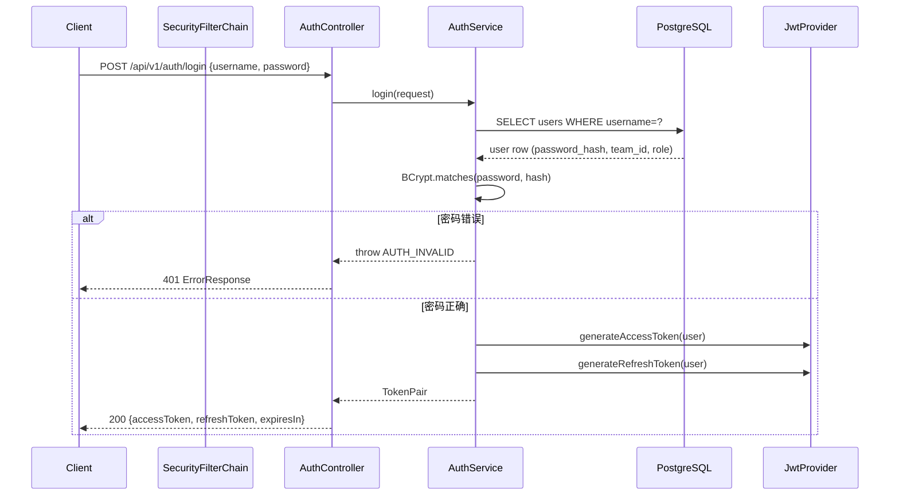
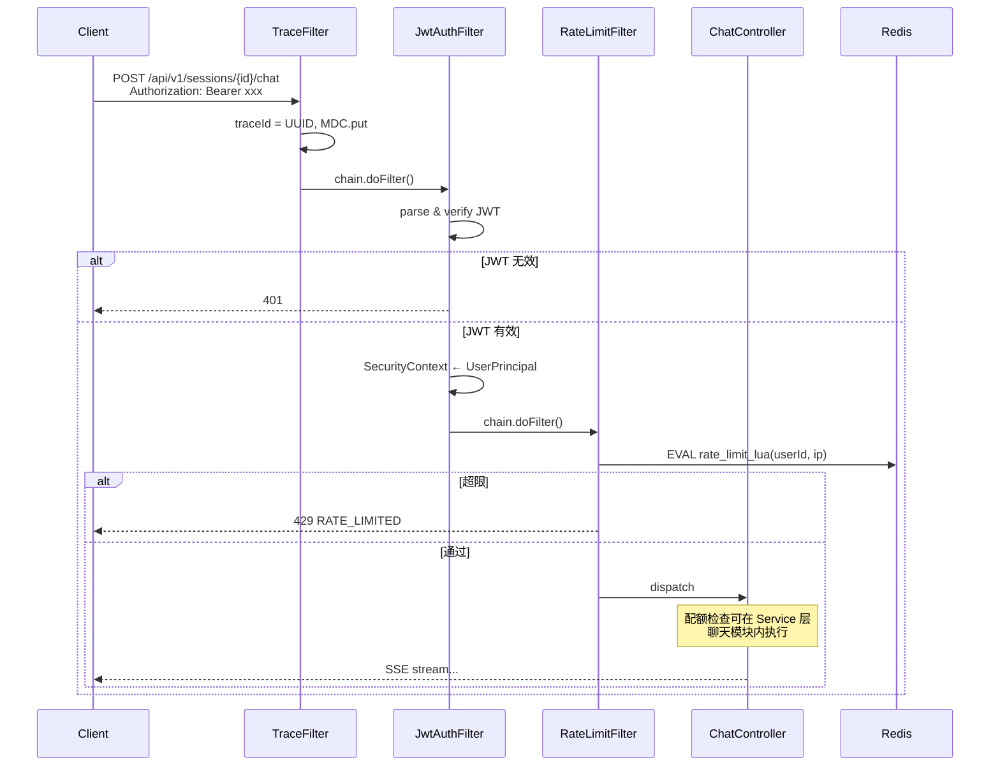
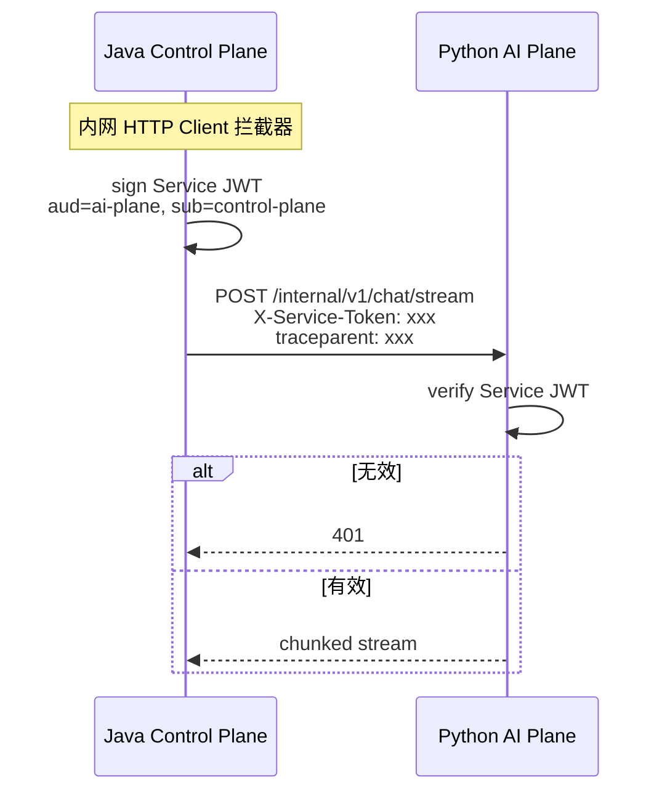

先输出 **6.1 网关与安全模块（Java）** 的完整细化设计；其余模块等你确认后再逐个生成。

---

# 6.1 网关与安全模块（Java）

> 所属系统：DevOps AI Copilot — 控制面（Java Control Plane）  
> 模块定位：所有对外流量的 **唯一入口**、身份与流量治理层  
> 参考业界：Spring Security + JWT（资源服务器模式）、API Gateway 限流（Kong/APISIX 思路在应用内实现）、OAuth2 Bearer Token 惯例

---

## 1. 功能背景与边界

### 1.1 功能背景

企业内 AI 排查平台不能「裸 API」：

- 研发账号需登录，操作可追溯到人  
- 按研发组控制调用频率与 Token 配额，防止刷爆 LLM 成本  
- Java 是公网唯一入口，必须在进入业务前完成 **认证 → 鉴权 → 限流**  
- 与 Python AI Plane 通信需 **Service Token**，避免内网接口被滥用  

本模块解决：**谁能访问、能访问多少、请求如何被标准化处理**。

### 1.2 模块职责（In Scope）

| 能力 | 说明 |
|------|------|
| 用户注册 / 登录 | 签发 Access Token + Refresh Token |
| Token 刷新 | Refresh Token 换新 Access Token |
| JWT 校验 | 每个受保护 API 校验身份 |
| RBAC 粗粒度授权 | `USER` / `ADMIN` 角色 |
| API 限流 | 用户级 + IP 级（Redis Lua） |
| 配额预检入口 | 聊天前触发配额检查（与 Redis 协作） |
| Service Token 校验 | 保护 `/internal/v1/**` 仅供 Python 调用 |
| 统一异常与错误体 | RFC 7807 风格或统一 `ErrorResponse` |
| 安全响应头 | 基础 HTTP Security Headers（MVP 简化） |
| CORS | 仅 dev profile 放开 |

### 1.3 模块边界（Out of Scope）

| 不属于本模块 | 归属 |
|--------------|------|
| Session / Message CRUD | 6.2 会话与元数据 |
| Workspace 级细粒度 ACL | V2 |
| OAuth2 对接企业 SSO（LDAP/OIDC） | V2 |
| WAF / DDoS 防护 | 基础设施层（Nginx/Cloudflare） |
| Python 侧二次限流 | AI Plane（可选双保险） |
| 聊天 SSE 业务逻辑 | 6.2 |
| 全链路 Trace 埋点细节 | 6.7（本模块只注入 traceId） |

### 1.4 在系统中的位置

```text
Client ──HTTPS──► [6.1 网关与安全] ──► [6.2 会话] / [6.3 文件] / [Admin]
                         │
                         ├── PostgreSQL (users)
                         ├── Redis (限流/配额/Token 黑名单)
                         └── 生成 traceId → 下游全链路
```

---

## 2. 流程图

### 2.1 业务流程图：用户从注册到调用受保护 API

```text
┌─────────┐
│  开始   │
└────┬────┘
     ▼
┌─────────────┐     否      ┌──────────────┐
│ 已有账号？   │────────────►│ POST /register│
└────┬────────┘             │ 写 users 表   │
     │是                     └──────┬───────┘
     ▼                              │
┌─────────────┐◄────────────────────┘
│ POST /login │
│ 校验密码     │
└────┬────────┘
     ▼
┌─────────────────────┐
│ 返回 accessToken     │
│      refreshToken    │
└────┬────────────────┘
     ▼
┌─────────────────────┐
│ 客户端带 Bearer 调 API│
└────┬────────────────┘
     ▼
┌─────────────┐  无效   ┌──────────────┐
│ JWT 校验     │────────►│ 401 终止      │
└────┬────────┘         └──────────────┘
     │有效
     ▼
┌─────────────┐  超限   ┌──────────────┐
│ 限流检查     │────────►│ 429 终止      │
└────┬────────┘         └──────────────┘
     │通过
     ▼
┌─────────────┐  无权限 ┌──────────────┐
│ RBAC 检查    │────────►│ 403 终止      │
└────┬────────┘         └──────────────┘
     ▼
┌─────────────┐
│ 进入业务模块  │
└─────────────┘
```

### 2.2 业务流程图：Token 刷新

```text
Access Token 过期（15min）
        │
        ▼
POST /auth/refresh  (body: refreshToken)
        │
        ├── refresh 无效/过期/已吊销 ──► 401，要求重新登录
        │
        └── 有效
              ├── 签发新 accessToken
              ├── （生产）Rotation：签发新 refresh，旧 refresh 入黑名单
              └── 返回给客户端
```

### 2.3 时序图：登录



### 2.4 时序图：受保护 API 请求（以聊天前为例）



### 2.5 时序图：Java 调 Python 的 Service Token



---

## 3. 具体实现逻辑

### 3.1 技术栈总览

| 技术 | 用途 | 选型原因 |
|------|------|----------|
| **Spring Security 6** | Filter 链、方法级 `@PreAuthorize` | Spring Boot 3 标配；生态成熟 |
| **JJWT / Nimbus JOSE** | JWT 签发与校验 | 轻量；不引入完整 OAuth2 Authorization Server |
| **BCrypt** | 密码哈希 | 业界默认；Spring Security `PasswordEncoder` 内置 |
| **Spring Validation** | 登录/register 参数校验 | 与 Controller 解耦 |
| **Redis + Lua** | 原子限流 | 高并发下避免竞态；APISIX/Kong 限流内核同类思路 |
| **Servlet Filter / OncePerRequestFilter** | TraceId、限流 | 在 Security 链前后均可插入 |
| **@ControllerAdvice** | 全局异常 | 统一错误体 |

**业界对照**：

- 大厂对外 API：Gateway（Kong）+ OAuth2 / JWT  
- 本项目 MVP：**应用内 Security Filter** 代替独立 Gateway，降低运维复杂度；生产可前置 Nginx/APISIX。

---

### 3.2 包结构建议

```text
com.devops.copilot.modules.security
├── config/
│   ├── SecurityConfig.java
│   └── PasswordEncoderConfig.java
├── filter/
│   ├── TraceIdFilter.java
│   ├── JwtAuthenticationFilter.java
│   ├── RateLimitFilter.java
│   └── ServiceTokenFilter.java          // 仅 /internal/**
├── controller/
│   └── AuthController.java
├── service/
│   └── AuthService.java
├── domain/
│   ├── UserPrincipal.java
│   └── TokenPair.java
├── jwt/
│   ├── JwtProperties.java
│   ├── JwtTokenProvider.java
│   └── ServiceTokenProvider.java
├── ratelimit/
│   ├── RateLimitProperties.java
│   └── RateLimitLuaScript.java
└── exception/
    └── SecurityErrorCodes.java
```

---

### 3.3 JWT 设计

#### Access Token Claims

```json
{
  "sub": "1001",
  "username": "zhangsan",
  "teamId": 10,
  "role": "USER",
  "type": "access",
  "iat": 1710000000,
  "exp": 1710000900
}
```

| 参数 | MVP | 生产建议 |
|------|-----|----------|
| 算法 | HS256（单密钥） | RS256（公私钥）；或 OAuth2 OP 签发 |
| Access 有效期 | 15 min | 15~30 min |
| Refresh 有效期 | 7 days | 7~30 days + Rotation |
| 存储 | 客户端内存/localStorage | 生产：Refresh 用 HttpOnly Cookie |

#### 实现逻辑（`JwtTokenProvider`）

```text
generateAccessToken(User user):
  claims = { sub, username, teamId, role, type=access }
  return JWS.sign(secret, claims, exp=now+15m)

verifyToken(token):
  parse JWS
  if expired → throw TOKEN_EXPIRED
  if type != access → throw INVALID_TOKEN
  return UserPrincipal
```

**选型原因**：JWT 无状态，Java 多实例不需 Session 粘滞；适合 API + SSE（SSE 长连接期间 Token 可能过期，靠 Refresh 或前端静默刷新）。

---

### 3.4 Spring Security Filter 链顺序

```text
Request
  → TraceIdFilter              (Order: HIGHEST)
  → CorsFilter                 (dev only)
  → JwtAuthenticationFilter    (公开路径 skip)
  → RateLimitFilter            (仅 authenticated 或全路径)
  → UsernamePassword...        (不用表单登录，可禁用)
  → AuthorizationFilter
  → Controller
```

#### 公开路径（permitAll）

```text
POST /api/v1/auth/register
POST /api/v1/auth/login
POST /api/v1/auth/refresh
GET  /actuator/health
GET  /actuator/prometheus      (MVP: permitAll；生产: 内网或 Basic Auth)
```

#### 内部路径（Service Token，不走用户 JWT）

```text
/internal/v1/**
  → ServiceTokenFilter 校验 aud=ai-plane
  → 无用户 SecurityContext（或从 header 透传 X-User-Id 仅供审计）
```

---

### 3.5 注册 / 登录实现逻辑

#### Register

```text
POST /api/v1/auth/register
  @Valid RegisterRequest { username, password }
  1. 校验 username 唯一
  2. password 强度（MVP: 长度>=8；生产: 复杂度策略）
  3. password_hash = BCrypt.encode(password, strength=10)
  4. INSERT users (username, password_hash, team_id=1, role=USER)  -- 默认组见 teams 种子数据
  5. 返回 201 或自动 login 返回 TokenPair
```

#### Login

```text
POST /api/v1/auth/login
  1. SELECT user BY username
  2. BCrypt.matches — 失败统一返回 AUTH_INVALID（不透露用户是否存在）
  3. 生成 access + refresh
  4. （生产）记录 login_audit 表；异常 IP 告警
  5. 返回 TokenPair
```

**业界实践**：登录失败统一文案，防用户枚举。

---

### 3.6 限流实现（Redis Lua 令牌桶简化版）

#### 维度

| 维度 | Key | MVP 限额示例 |
|------|-----|--------------|
| 用户 | `ratelimit:user:{userId}` | 60 req/min |
| IP | `ratelimit:ip:{ip}` | 120 req/min |
| 聊天 | 可在 6.2 单独做 | 10 concurrent SSE/user |

#### Lua 脚本逻辑（伪代码）

```lua
-- KEYS[1] = bucket key
-- ARGV[1] = now_ms, ARGV[2] = capacity, ARGV[3] = refill_rate, ARGV[4] = cost
local data = redis.call('HMGET', KEYS[1], 'tokens', 'ts')
local tokens = tonumber(data[1]) or capacity
local last = tonumber(data[2]) or now
tokens = min(capacity, tokens + (now-last)*rate/1000)
if tokens < cost then return 0 end
tokens = tokens - cost
redis.call('HMSET', KEYS[1], 'tokens', tokens, 'ts', now)
redis.call('EXPIRE', KEYS[1], 120)
return 1
```

#### `RateLimitFilter`

```text
if path in permitAll: pass
userId = SecurityContext.userId
ip = X-Forwarded-For 或 remoteAddr
if lua(userKey) == 0 OR lua(ipKey) == 0:
  throw RATE_LIMITED (429)
chain.doFilter()
```

**选型原因**：限流在 Redis 集中存储，多 Java 实例一致；Lua 保证原子性。  
**业界对照**：Kong `rate-limiting`、Sentinel、Resilience4j 限流 — MVP 用 Redis Lua 足够练工程原理。

---

### 3.7 配额预检（与 6.2 协作）

本模块 **提供能力入口**，聊天配额逻辑主要在 `ChatService`，但 Key 规范归属安全/配额域：

```text
Redis key: quota:team:{teamId}:daily_tokens
聊天前: GET 当前用量 + 估算本次 prompt tokens
若 exceeded → throw QUOTA_EXCEEDED (429)
聊天后: INCRBY 实际 usage（来自 LLM 返回）
```

限额上限读 `teams.daily_token_limit`（默认组 id=1）；配额用尽统一返回 **HTTP 429** + `QUOTA_EXCEEDED`。

---

### 3.8 RBAC 实现

#### MVP：角色枚举

```java
@PreAuthorize("hasRole('ADMIN')")
@GetMapping("/api/v1/admin/users")
```

```text
USER:  自己的 session/message/file
ADMIN: /admin/** + 只读系统指标
```

#### `UserPrincipal`

```java
record UserPrincipal(Long userId, String username, Long teamId, Role role)
  implements UserDetails
```

**选型原因**：MVP 二角色够用；Spring `@PreAuthorize` 声明式，清晰。

---

### 3.9 Service Token（Java → Python）

```text
sign():
  claims = { sub: "control-plane", aud: "ai-plane", type: "service" }
  exp = 5 min   // 短有效期

Python FastAPI 依赖项:
  verify_service_token(X-Service-Token)
```

MVP：HS256 共享密钥 `SERVICE_TOKEN_SECRET`  
生产：mTLS 或 JWT + JWKS 轮换；K8s ServiceAccount 身份

**边界**：Service Token **不代表终端用户**；用户身份用 request body 里 `userContext` 透传，Python **不信任 body  alone**，敏感读操作应回调 Java internal API 校验。

---

### 3.10 统一异常与错误响应

```java
@RestControllerAdvice
class GlobalExceptionHandler {
  @ExceptionHandler(RateLimitException.class)
  ResponseEntity<ErrorResponse> handle(...) {
    return status(429).body(new ErrorResponse("RATE_LIMITED", msg, traceId));
  }
}
```

```json
{
  "code": "AUTH_INVALID",
  "message": "Invalid credentials",
  "traceId": "4bf92f3577b34da6",
  "timestamp": "2026-07-06T10:00:00Z"
}
```

**业界对照**：Google API / Stripe API 错误结构；Problem Details RFC 7807。

---

### 3.11 TraceId 注入（与 6.7 衔接）

```java
// TraceIdFilter — 以 W3C traceparent 为准（P9）
String traceparent = request.getHeader("traceparent");
String traceId = extractTraceIdFromTraceparent(traceparent)
    .orElse(UUID.randomUUID().toString().replace("-",""));
MDC.put("traceId", traceId);
response.setHeader("X-Trace-Id", traceId);  // 派生字段，供客户端报障
```

所有 401/429 响应也带 `traceId`，便于用户报障。

---

### 3.12 配置项（`application.yml`）

```yaml
security:
  jwt:
    secret: ${JWT_SECRET}
    access-expiration-minutes: 15
    refresh-expiration-days: 7
  service-token:
    secret: ${SERVICE_TOKEN_SECRET}
    expiration-minutes: 5
  rate-limit:
    user-capacity: 60
    user-refill-per-second: 1
    ip-capacity: 120
  cors:
    enabled: ${CORS_ENABLED:false}
```

生产：密钥走环境变量 / Vault，禁止进 Git。

---

## 4. 可扩展方案

### 4.1 认证扩展路线图

```text
MVP          V1              V2
JWT 自签发   Refresh Rotation  OIDC / LDAP / 企业微信
本地 users   login_audit 表   SSO 统一身份
```

| 扩展 | 做法 |
|------|------|
| **企业 SSO** | Spring Security OAuth2 Client；JWT 改为接收 IdP token 或换发内部 JWT |
| **API Key** | `api_keys` 表 + `ApiKeyFilter`，供脚本/CI 调用 |
| **多因素认证** | TOTP；登录流程加一步 |
| **设备绑定** | refresh token 绑 device_id |

### 4.2 限流扩展

| 扩展 | 方案 |
|------|------|
| 分布式更复杂策略 | 迁 Sentinel / Resilience4j；或前置 APISIX |
| 按接口差异化 | `rate_limit_rules` 配置：chat=10/min, upload=5/min |
| 全局限流 | 保护 LLM 总 QPS 的全局 bucket |
| 熔断 | Resilience4j CircuitBreaker 包 LLM 调用（偏 6.2/6.5） |

### 4.3 授权扩展

```text
MVP:  USER / ADMIN
V1:   workspace_member (OWNER, MEMBER)
V2:   资源级 ACL (agent_id, document_id)
```

实现：`@PreAuthorize("@authz.canAccessSession(#sessionId)")` + `AuthorizationService`。

### 4.4 网关层演进

```text
MVP:  Spring Security in-app
V1:   Nginx 反向代理 + TLS 终止
V2:   APISIX / Kong 统一入口、WAF、IP 黑白名单
```

---

## 5. MVP vs 生产：技术差距清单

| 能力 | MVP 实现 | 生产实现 | 差距风险 |
|------|----------|----------|----------|
| JWT 算法 | HS256 单密钥 | RS256 + JWKS 轮换 | 密钥泄漏影响面大 |
| Refresh Token | 长期有效、无 Rotation | Rotation + 黑名单 Redis | 被盗 refresh 难吊销 |
| Token 存储 | 前端 localStorage | HttpOnly Cookie + CSRF | XSS 盗 token |
| 限流 | 固定阈值 Redis Lua | 动态配置中心 + 多维度 | 误伤/不够细 |
| 配额 | Redis 日计数 | DB 配置 + 计费对账 | 成本失控 |
| RBAC | 2 角色 | Workspace + 资源 ACL | 越权访问 |
| 内部调用 | Service JWT 共享密钥 | mTLS | 内网伪造请求 |
| 审计 | 仅日志 | login_audit + admin 操作表 | 合规不足 |
| CORS | dev 全开 | 白名单域名 | 跨域滥用 |
| Actuator | prometheus 公开 | 内网 + 认证 | 指标泄漏 |
| 密码策略 | 长度校验 | 复杂度 + 撞库防护 | 弱密码 |
| 防暴力破解 | 无 | 登录失败锁定 / CAPTCHA | 撞库 |
| WAF/DDoS | 无 | 云 WAF / Gateway | 大流量攻击 |

---

## 6. 模块交付验收标准（MVP）

| # | 验收项 |
|---|--------|
| 1 | 未带 Token 访问 `/api/v1/sessions` 返回 401 |
| 2 | 错误密码登录返回 401，文案不区分「用户不存在」 |
| 3 | 带有效 Token 可访问受保护 API |
| 4 | 1 分钟内超过阈值返回 429，响应含 `traceId` |
| 5 | Refresh 可换新 Access；过期 Refresh 返回 401 |
| 6 | `/internal/v1/**` 无 Service Token 返回 401 |
| 7 | ADMIN 可访问 `/admin/users`；USER 访问返回 403 |
| 8 | 所有错误响应结构统一 |

---

## 7. 与其他模块的接口约定

| 下游模块 | 本模块提供 |
|----------|------------|
| 6.2 会话 | `UserPrincipal`（userId, teamId）、已通过的限流 |
| 6.3 文件 | 同上；上传接口单独 upload 限流 |
| 6.7 遥测 | `traceId` in MDC；401/429 计数指标 |
| Python | `ServiceTokenProvider.sign()`；`traceparent` header |

---

**6.1 网关与安全模块（Java）** 已全部细化完毕。
