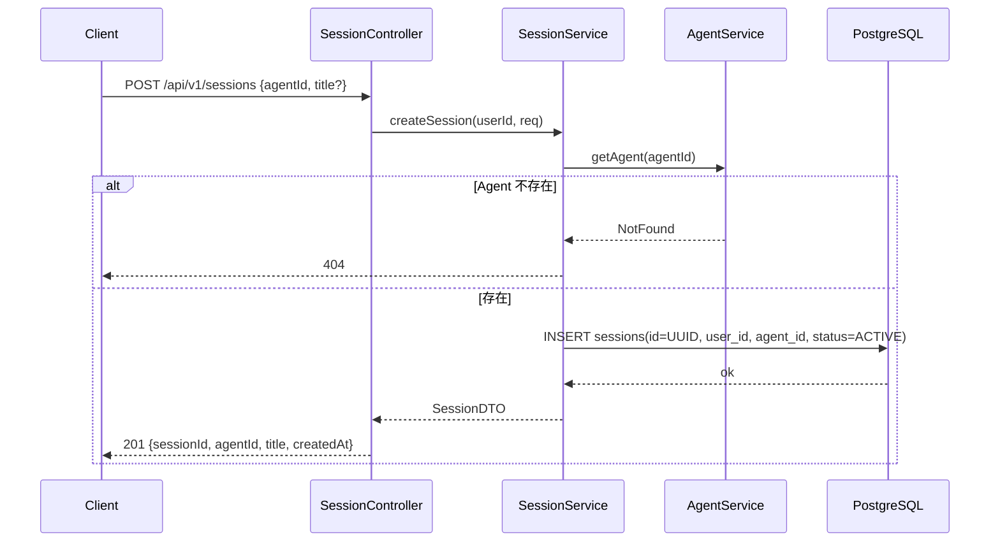
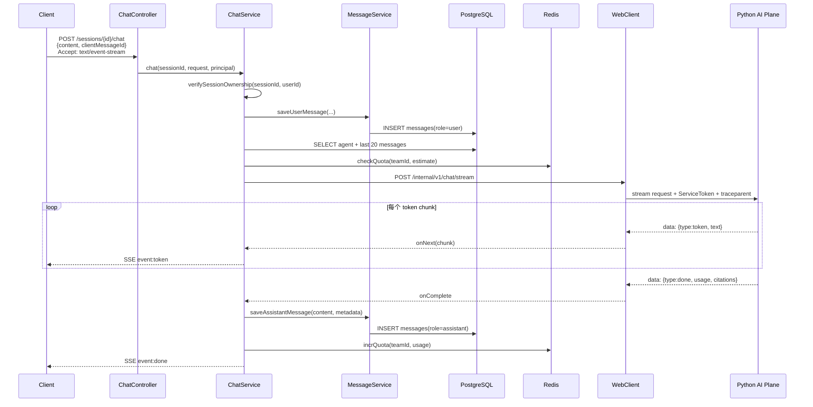
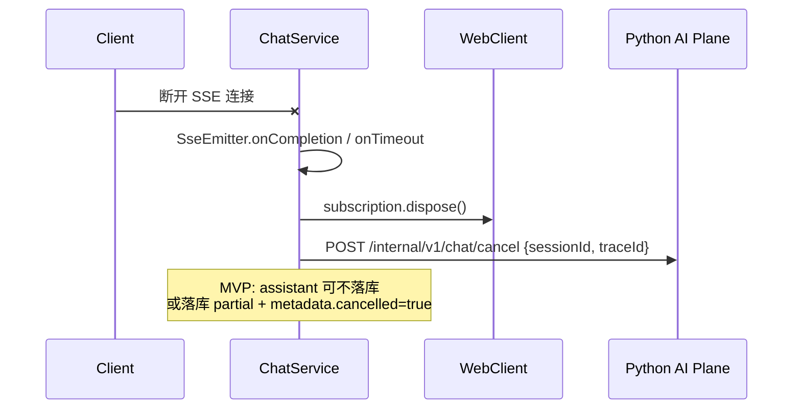

# 6.2 会话与元数据模块（Java）

> 所属系统：DevOps AI Copilot — 控制面（Java Control Plane）  
> 模块定位：对话 **业务中枢** — 管理 Session、Message、Agent 配置，并作为 **SSE 终点** 串联 Python AI Plane  
> 参考业界：OpenAI Chat Completions API（session/message 模型）、Dify Conversation API、LangSmith Run/Thread 概念（简化版）

---

## 1. 功能背景与边界

### 1.1 功能背景

DevOps AI Copilot 的核心体验是：**研发人员围绕一次线上故障，与 Agent 多轮对话排查**。这需要：

- **会话（Session）**：一次排查话题的容器，可绑定特定 Agent  
- **消息（Message）**：每轮问答的可审计记录  
- **Agent 元数据**：模型、Prompt、RAG/MCP 开关等配置  
- **流式聊天入口**：对外 SSE，对内 HTTP 流式调用 Python  

本模块是 **6.1 安全模块之后的第一业务层**，也是 Java 与 Python 的 **编排枢纽**。

### 1.2 模块职责（In Scope）

| 能力 | 说明 |
|------|------|
| Agent CRUD | 诊断 Agent 配置管理（Admin 写，全员读） |
| Session 生命周期 | 创建、列表、归档、归属校验 |
| Message 持久化 | user/assistant（+ 可选 tool）消息落库 |
| 历史消息查询 | 分页、按 session 拉取 |
| **SSE 聊天 API** | `POST /sessions/{id}/chat` |
| 流式透传 | WebClient 订阅 Python 流 → 转发 SSE |
| 取消与超时 | 客户端断开 → 取消 Python/LLM |
| 幂等 | `client_message_id` 防重复提交 |
| 配额协作 | 聊天前后更新 team Token 用量 |
| Internal API | 供 Python Tool 读历史、供其他模块读 Agent |

### 1.3 模块边界（Out of Scope）

| 不属于本模块 | 归属 |
|--------------|------|
| JWT 签发、限流 Filter | 6.1 |
| LangGraph 图执行、RAG 检索 | 6.4 / 6.5 Python |
| MCP 调用 | 6.6 Python |
| 文件上传 | 6.3 |
| 向量写入 | 6.4 Python（经 internal API 或直连 PG） |
| 完整配额计费系统 | V2；MVP 用 Redis 计数 |
| 前端 UI | 未来 Next.js |

### 1.4 在系统中的位置

```text
                    ┌─────────────────────┐
                    │  6.1 网关与安全      │
                    └──────────┬──────────┘
                               │
                    ┌──────────▼──────────┐
                    │  6.2 会话与元数据    │◄─── 本模块
                    │  Agent/Session/Msg  │
                    │  Chat SSE           │
                    └──────┬──────┬───────┘
                           │      │
              ┌────────────┘      └────────────┐
              ▼                              ▼
           PostgreSQL                      WebClient
     agents/sessions/messages          Python AI Plane
              │
              ▼
           Redis（配额）
```

---

## 2. 流程图

### 2.1 业务流程图：会话全生命周期

```text
┌──────────┐
│ 用户登录  │
└────┬─────┘
     ▼
┌──────────────────┐
│ 选择 Agent        │
│ GET /agents       │
└────┬─────────────┘
     ▼
┌──────────────────┐
│ 创建 Session      │
│ POST /sessions    │──► INSERT sessions (ACTIVE)
└────┬─────────────┘
     ▼
┌──────────────────┐
│ 多轮聊天          │◄─────────────┐
│ POST .../chat    │              │
│ (SSE)            │              │
└────┬─────────────┘              │
     │                            │
     ├── 继续追问 ─────────────────┘
     │
     ├── 查看历史
     │     GET .../messages
     │
     └── 结束 / 归档
           PATCH status=ARCHIVED
```

### 2.2 业务流程图：单次聊天（核心）

```text
┌─────────────┐
│ 用户发送消息  │
│ + clientMsgId│
└──────┬──────┘
       ▼
┌─────────────┐  否   ┌──────────────┐
│ Session 归属 │──────►│ 403          │
│ & ACTIVE?   │       └──────────────┘
└──────┬──────┘
       │是
       ▼
┌─────────────┐  重复  ┌──────────────────────────┐
│ 幂等检查     │──────►│ 返回已有 assistant 结果    │
│             │       │ （不调 Python，不发 SSE 流）│
└──────┬──────┘       └──────────────────────────┘
       │新消息
       ▼
┌─────────────┐  不足  ┌──────────────┐
│ 配额预检     │──────►│ 429 QUOTA    │
└──────┬──────┘       └──────────────┘
       ▼
┌─────────────┐
│ INSERT user │
│ message     │
└──────┬──────┘
       ▼
┌─────────────┐
│ 加载 Agent  │
│ + 历史 N 条 │
└──────┬──────┘
       ▼
┌─────────────┐
│ WebClient   │
│ → Python    │
│   stream    │
└──────┬──────┘
       ▼
┌─────────────┐
│ SSE 推 token│
│ 给客户端     │
└──────┬──────┘
       ▼
┌─────────────┐  失败  ┌──────────────┐
│ 流结束      │──────►│ assistant 行  │
└──────┬──────┘       │ + error meta │
       │成功          └──────────────┘
       ▼
┌─────────────┐
│ INSERT      │
│ assistant   │
│ + 扣配额     │
└─────────────┘
```

### 2.3 时序图：创建 Session



### 2.4 时序图：SSE 聊天（成功路径）



### 2.5 时序图：客户端断开（取消）



---

## 3. 具体实现逻辑

### 3.1 技术栈总览

| 技术 | 用途 | 选型原因 |
|------|------|----------|
| **Spring Web MVC** | REST + SSE | 团队熟悉；SSE 用 `SseEmitter` 足够 |
| **MyBatis Plus** | Session/Message/Agent CRUD | 分页、条件查询方便；复杂 SQL 可手写 |
| **WebClient (Reactor)** | 调 Python 流式 API | 非阻塞读流；比 `RestTemplate` 适合 chunk 透传 |
| **SseEmitter** | 对客户端 SSE | Spring 原生；比 WebFlux 迁栈成本低 |
| **Jackson** | JSON 序列化 metadata | 与 Spring 一体 |
| **PostgreSQL UUID** | session/message 主键 | 分布式友好；URL 不暴露自增 |
| **Redis** | 配额 | 与 6.1 共用；**不缓存对话历史**（P7） |
| **@Transactional** | user message 写入 | 保证先落库再调 AI（可配置） |

**业界对照**：

| 业界 | 做法 | 本项目 |
|------|------|--------|
| OpenAI | Thread + Messages + Run stream | Session + Messages + Chat stream |
| Dify | Conversation + chat-messages blocking/streaming | 类似；我们 SSE 在 Java 终止 |
| ChatGPT | 前端直连 API | 我们 BFF 在 Java，便于审计 |

**为何 SSE 终点在 Java 而非 Python**：统一鉴权、日志、配额、审计；Python 不暴露公网（见架构总纲 P1/P3）。

---

### 3.2 包结构建议

```text
com.devops.copilot.modules.conversation
├── controller/
│   ├── AgentController.java
│   ├── SessionController.java
│   ├── MessageController.java
│   ├── ChatController.java
│   └── internal/
│       ├── InternalMessageController.java
│       └── InternalAgentController.java
├── service/
│   ├── AgentService.java
│   ├── SessionService.java
│   ├── MessageService.java
│   ├── ChatService.java
│   └── QuotaService.java
├── client/
│   ├── AiPlaneClient.java          // WebClient 封装
│   └── dto/
│       ├── InternalChatRequest.java
│       └── StreamEvent.java
├── domain/
│   ├── entity/ Agent, Session, Message
│   └── enums/ MessageRole, SessionStatus
├── mapper/
│   ├── AgentMapper.java
│   ├── SessionMapper.java
│   └── MessageMapper.java
└── sse/
    └── SseStreamBridge.java        // Python chunk → SseEmitter
```

---

### 3.3 Agent 元数据模块

#### 3.3.1 API

| 方法 | 路径 | 权限 | 说明 |
|------|------|------|------|
| GET | `/api/v1/agents` | USER | 列表 |
| GET | `/api/v1/agents/{id}` | USER | 详情 |
| POST | `/api/v1/agents` | ADMIN | 创建 |
| PUT | `/api/v1/agents/{id}` | ADMIN | 更新 |
| DELETE | `/api/v1/agents/{id}` | ADMIN | 软删或硬删 |

#### 3.3.2 实现逻辑

```text
createAgent(req):
  INSERT agents(name, model, system_prompt, enable_rag, enable_mcp, ...)
  config_json = merge(defaultConfig, req.configJson)

getAgentForChat(agentId):
  SELECT * FROM agents WHERE id = ?
  映射为 AgentConfigDTO（列 + config_json 展平）
```

#### 3.3.3 `config_json` 使用（本模块视角）

Chat 时组装 `InternalChatRequest.agentConfig`：

```json
{
  "model": "deepseek-chat",
  "systemPrompt": "...",
  "enableRag": true,
  "enableMcp": true,
  "ragTopK": 5,
  "temperature": 0.2,
  "ragScoreThreshold": 0.7,
  "maxHistoryMessages": 20,
  "mcpServers": ["prometheus", "postgres-readonly"]
}
```

**选型原因**：Agent 配置在 Java 管 CRUD 与权限；Python 无状态执行，符合「控制面 / 智能面」分离。

---

### 3.4 Session 模块

#### 3.4.1 API

| 方法 | 路径 | 说明 |
|------|------|------|
| POST | `/api/v1/sessions` | 创建 |
| GET | `/api/v1/sessions` | 当前用户列表，按 `updated_at DESC` |
| GET | `/api/v1/sessions/{id}` | 详情 |
| PATCH | `/api/v1/sessions/{id}` | 改 title / ARCHIVED |
| DELETE | `/api/v1/sessions/{id}` | MVP：软删 `status=ARCHIVED` |

#### 3.4.2 创建逻辑

```java
public SessionDTO create(Long userId, CreateSessionRequest req) {
    agentService.ensureExists(req.getAgentId());
    Session session = new Session();
    session.setId(UUID.randomUUID());
    session.setUserId(userId);
    session.setAgentId(req.getAgentId());
    session.setTitle(Optional.ofNullable(req.getTitle()).orElse("新会话"));
    session.setStatus(SessionStatus.ACTIVE);
    sessionMapper.insert(session);
    return toDTO(session);
}
```

#### 3.4.3 归属校验（所有 session 操作必调）

```java
public Session requireOwnedSession(UUID sessionId, Long userId) {
    Session s = sessionMapper.selectById(sessionId);
    if (s == null) throw notFound();
    if (!s.getUserId().equals(userId)) throw forbidden();
    if (s.getStatus() == ARCHIVED) throw sessionArchived();
    return s;
}
```

**业界实践**：B 端 API 资源必须校验 `resource.owner == currentUser`，不能仅靠 UUID 难猜。

---

### 3.5 Message 模块

#### 3.5.1 API

| 方法 | 路径 | 说明 |
|------|------|------|
| GET | `/api/v1/sessions/{id}/messages` | 分页历史 `?page=1&size=20` |

#### 3.5.2 落库策略（核心）

| 时机 | 操作 | role |
|------|------|------|
| 收到用户消息 | INSERT | `user` |
| 流式结束成功 | INSERT | `assistant` |
| 流式失败 | INSERT（可选） | `assistant`，`metadata.error` |
| 客户端取消 | 可不插 assistant | 或插 `metadata.cancelled=true` |
| Tool 中间结果（MVP） | 不单独插行 | 进 assistant `metadata.toolCalls` |
| Tool（V1.1） | INSERT | `tool` |

#### 3.5.3 幂等：`client_message_id`

```java
public Optional<Message> findExistingAssistant(UUID sessionId, String clientMessageId) {
    Message userMsg = messageMapper.findBySessionAndClientMsgId(sessionId, clientMessageId);
    if (userMsg == null) return Optional.empty();
    return messageMapper.findNextAssistantAfter(userMsg.getId());
}

public Message saveUserMessage(...) {
    if (findExistingAssistant(sessionId, req.getClientMessageId()).isPresent()) {
        throw new DuplicateMessageException(...); // Controller 层返回已有 assistant
    }
    ...
}
```

DB 唯一索引：`(session_id, client_message_id) WHERE client_message_id IS NOT NULL`  
**幂等语义**：相同 `clientMessageId` 重试 → 直接返回已落库的 assistant（含 metadata），**不二次调用 Python**。

#### 3.5.4 `metadata_json` 结构（assistant）

```json
{
  "citations": [{ "chunkId": "...", "documentTitle": "...", "score": 0.89 }],
  "toolCalls": [{ "name": "prometheus_query", "result": {} }],
  "usage": { "promptTokens": 1200, "completionTokens": 340 },
  "model": "deepseek-chat",
  "intent": "rag_and_tool",
  "latencyMs": 3200
}
```

Java 从 Python `done` 事件中解析写入；**不在 Java 拼 citations**（智能面负责）。`metadata_json` 存本轮图执行产出（审计快照），**不替代** `history` 作为下轮对话上下文；下轮仍从 PG 查 `messages.content` 组成 history（P7）。

#### 3.5.5 历史加载（供 Python）

```java
public List<ChatMessageDTO> loadHistory(UUID sessionId, int limit, UUID excludeMessageId) {
    return messageMapper.selectRecentExcluding(sessionId, limit, excludeMessageId)
        .stream()
        .map(m -> new ChatMessageDTO(m.getRole(), m.getContent()))
        .sorted(byCreatedAtAsc())
        .toList();
}
```

`limit` 来自 `agent.config_json.maxHistoryMessages`，默认 20。  
**不含本轮 user 消息**（`excludeMessageId` = 刚 INSERT 的 user message id）；当前轮走 `InternalChatRequest.userMessage`。

**业界对照**：OpenAI 也限制 context 窗口内历史条数；过长历史要 **摘要压缩**（V2）。

---

### 3.6 Chat 模块（SSE + WebClient）

#### 3.6.1 API

```http
POST /api/v1/sessions/{sessionId}/chat
Authorization: Bearer {accessToken}
Content-Type: application/json
Accept: text/event-stream

{
  "content": "今日早盘商品服务报 STATUS_899 错误是什么原因？",
  "clientMessageId": "cmsg-uuid-xxx"
}
```

#### 3.6.2 Controller

```java
@PostMapping(value = "/{sessionId}/chat", produces = MediaType.TEXT_EVENT_STREAM_VALUE)
public SseEmitter chat(@PathVariable UUID sessionId,
                         @Valid @RequestBody ChatRequest req,
                         @AuthenticationPrincipal UserPrincipal principal) {
    SseEmitter emitter = new SseEmitter(chatProperties.getSseTimeoutMs()); // e.g. 5min
    chatService.streamChat(sessionId, req, principal, emitter);
    return emitter;
}
```

`SseEmitter` 超时：MVP 5min；生产可配置 + 心跳 `event: ping`。

#### 3.6.3 ChatService 核心流程

```java
public void streamChat(UUID sessionId, ChatRequest req,
                       UserPrincipal principal, SseEmitter emitter) {
    Session session = sessionService.requireOwnedSession(sessionId, principal.userId());
    quotaService.preCheck(principal.teamId(), estimateTokens(req.getContent()));

    Message userMsg = messageService.saveUserMessage(sessionId, req, principal.userId());
    AgentConfig config = agentService.getAgentForChat(session.getAgentId());
    List<ChatMessageDTO> history = messageService.loadHistory(sessionId, config.getMaxHistory(), userMsg.getId());

    InternalChatRequest internal = InternalChatRequest.builder()
        .traceId(MDC.get("traceId"))
        .sessionId(sessionId.toString())
        .userMessage(req.getContent())
        .history(history)
        .agentConfig(config)
        .userContext(new UserContext(principal.userId(), principal.teamId()))
        .build();

    StringBuilder buffer = new StringBuilder();
    AtomicReference<StreamDoneEvent> doneRef = new AtomicReference<>();

    Disposable sub = aiPlaneClient.streamChat(internal)
        .doOnNext(evt -> {
            if ("token".equals(evt.getType())) {
                buffer.append(evt.getText());
                sseBridge.send(emitter, "token", Map.of("text", evt.getText()));
            } else if ("citation".equals(evt.getType())) {
                sseBridge.send(emitter, "citation", evt.getData());
            } else if ("done".equals(evt.getType())) {
                doneRef.set(evt.getDone());
            }
        })
        .doOnComplete(() -> {
            StreamDoneEvent done = doneRef.get();
            MessageMetadata meta = mapMetadata(done);
            messageService.saveAssistantMessage(sessionId, buffer.toString(), meta);
            quotaService.charge(principal.teamId(), done.getUsage());
            sseBridge.send(emitter, "done", Map.of("messageId", ...));
            emitter.complete();
        })
        .doOnError(err -> handleStreamError(emitter, err))
        .subscribe();

    emitter.onCompletion(() -> { sub.dispose(); aiPlaneClient.cancel(sessionId); });
    emitter.onTimeout(() -> { sub.dispose(); emitter.complete(); });
}
```

#### 3.6.4 AiPlaneClient（WebClient）

```java
public Flux<StreamEvent> streamChat(InternalChatRequest req) {
    return webClient.post()
        .uri("/internal/v1/chat/stream")
        .header("X-Service-Token", serviceTokenProvider.sign())
        .header("traceparent", traceContext.inject())
        .bodyValue(req)
        .accept(MediaType.parseMediaType("application/x-ndjson"))
        .retrieve()
        .bodyToFlux(String.class)
        .map(line -> objectMapper.readValue(line, StreamEvent.class));
}
```

**内外流式协议分工（P8）**：

| 链路 | 协议 | 说明 |
|------|------|------|
| Client ↔ Java | SSE (`text/event-stream`) | 对浏览器/API 客户端 |
| Java ↔ Python | NDJSON (`application/x-ndjson`) | 每行一个 JSON；Java 解析后转 SSE |

**技术细节**：

| 点 | MVP | 说明 |
|----|-----|------|
| 解析格式 | NDJSON 按行解析 | 统一 `StreamEvent` DTO |
| 连接池 | WebClient 默认 | 生产调 `maxConnections`、超时 |
| 读超时 | 60~120s | 与 LLM 一致 |
| 重试 | 流式 **不重试** | 重试会产生重复 token；失败让用户重发 |
| 背压 | `Flux` 默认 | 客户端慢则 TCP 背压 |

**选型原因**：WebClient + Reactor 可在 Servlet 线程外读流，避免阻塞 Tomcat 线程池；这是 **Java 侧 AI 后端关键工程点**。

#### 3.6.6 SSE 与 JWT（MVP）

| 规则 | 说明 |
|------|------|
| 校验时机 | 仅 **建立 SSE 连接时** 校验 Access Token |
| 连接期间 | 不因 Access Token 15min 过期而中断流 |
| 前端责任 | Token 将过期前静默 `POST /auth/refresh`；新开会话须带新 Token |
| 生产增强 | V1 可在 `ping` 事件中提示客户端 refresh |

---

#### 3.6.7 对客户端 SSE 事件协议

| event | data 示例 | 时机 |
|-------|-----------|------|
| `token` | `{"text":"根据"}` | 每个 LLM chunk |
| `citation` | `{"chunks":[...]}` | 检索完成可先发（可选） |
| `done` | `{"messageId":"...","usage":{...}}` | 结束 |
| `error` | `{"code":"LLM_TIMEOUT"}` | 失败 |
| `ping` | `{}` | 每 15s 保活（生产） |

---

### 3.7 配额服务（QuotaService）

```java
public void preCheck(Long teamId, int estimateTokens) {
    long used = redis.getLong("quota:team:" + teamId + ":daily_tokens");
    long limit = quotaProperties.getDailyLimit(teamId); // MVP 全局配置
    if (used + estimateTokens > limit) throw quotaExceeded();
}

public void charge(Long teamId, TokenUsage usage) {
    redis.incrBy("quota:team:" + teamId + ":daily_tokens", usage.total());
}
```

估算：`estimateTokens ≈ content.length() / 4`（粗算）；生产用 tiktoken 库或 LLM 返回的实际值。

---

### 3.8 Internal API（供 Python）

| 方法 | 路径 | 说明 |
|------|------|------|
| GET | `/internal/v1/sessions/{id}/messages` | Tool 拉历史；校验 Service Token |
| GET | `/internal/v1/agents/{id}` | 拉 Agent 配置 |
| GET | `/internal/v1/analysis-jobs/{id}` | 场景二读分析结果（6.3 协作） |

```text
Python Tool get_conversation_context:
  GET /internal/v1/sessions/{id}/messages?limit=10
  Header: X-Service-Token
  Java 可要求 Query: userId= 并与 session 归属交叉校验
```

---

### 3.9 数据库与 MyBatis 要点

#### 关键 SQL

```sql
-- 会话列表
SELECT id, title, agent_id, status, updated_at
FROM sessions
WHERE user_id = #{userId}
ORDER BY updated_at DESC
LIMIT #{size} OFFSET #{offset};

-- 最近 N 条消息（注意先 DESC 取 N 再 ASC 排序）
SELECT role, content, created_at
FROM messages
WHERE session_id = #{sessionId}
ORDER BY created_at DESC
LIMIT #{limit};

-- touch session
UPDATE sessions SET updated_at = NOW() WHERE id = #{sessionId};
```

#### 索引（回顾）

- `sessions(user_id, updated_at DESC)`  
- `messages(session_id, created_at)`  
- `messages(session_id, client_message_id) UNIQUE`

---

### 3.10 与 6.1 的协作点

| 点 | 说明 |
|----|------|
| 身份 | `@AuthenticationPrincipal UserPrincipal` |
| 限流 | 6.1 已做通用 QPS；本模块可对 `chat` 单独限并发 SSE |
| traceId | MDC 传入 `InternalChatRequest` |
| 错误码 | 复用 `GlobalExceptionHandler` |

#### Chat 专用并发限流（建议加在 ChatService 入口）

```text
Redis key: sse:concurrent:user:{userId}
INCR before stream; DECR on complete/timeout
if > 3 → 429 TOO_MANY_STREAMS
```

**业界对照**：防止单用户占满连接与 LLM 配额。

---

## 4. 可扩展方案

### 4.1 Session 扩展

| 扩展 | 方案 |
|------|------|
| 会话分组/文件夹 | `session_folders` 表 |
| 多用户共享会话 | `session_members` + 权限校验改 `requireAccessibleSession` |
| 会话标题自动生成 | 首条 user 消息后异步 LLM 摘要 title |
| Agent 配置快照 | `sessions.agent_config_snapshot JSONB` 创建时固化 |

### 4.2 Message 扩展

| 扩展 | 方案 |
|------|------|
| tool 独立行 | `role=tool`；喂回 LangGraph 更自然 |
| 重新生成 | 同一 `user_message_id` 多条 `assistant`；`metadata.regenerated=true` |
| 消息编辑/删除 | 合规需求；软删 `deleted_at` |
| 长历史压缩 | 超过 N 条触发 Summary Job（Kafka） |
| 全文搜索 | PostgreSQL `tsvector` on content |

### 4.3 Chat 扩展

| 扩展 | 方案 |
|------|------|
| WebSocket | 双向通信；MVP SSE 够用 |
| 多模态 | `content` 改 multipart；图片 URL 进 metadata |
| 人机协同 | `role=system` 插入审批节点 |
| 异步聊天 | 202 + 轮询；适合超长分析 |

### 4.4 高可用扩展

```text
MVP:  单 Java 实例 + SseEmitter
V1:   多实例 + Redis 记录 stream 状态（复杂）
生产: 考虑专用 Streaming Gateway 或 stickiness（不推荐）
      更主流：保持 SSE 在 Java，控制并发 + 超时 + 取消
```

**业界现实**：SSE 多实例横向扩展较难；MVP 单机 50 连接足够；生产靠 **限并发 + 排队** 先于 **分布式 SSE**。

---

## 5. MVP vs 生产：技术差距清单

| 能力 | MVP | 生产 | 差距说明 |
|------|-----|------|----------|
| SSE 实现 | `SseEmitter` 单线程桥接 | 心跳 ping、优雅断开、连接数监控 | 代理超时需调 Nginx `proxy_read_timeout` |
| WebClient | 默认配置 | 连接池、超时、熔断、指标 | LLM 慢导致连接耗尽 |
| 历史条数 | 固定最近 20 条 | 按 token 数动态裁剪 | 超 context 窗口 |
| 幂等 | DB 唯一索引 | + Redis 短期去重 | 极高并发双写 |
| 配额 | Redis 日计数 | DB 对账 + 告警 + 套餐 | 成本失控风险 |
| assistant 失败 | metadata.error | Dead letter + 用户可重试 UI | 体验 |
| 取消 | dispose + cancel API | 确认 Python 上游 LLM abort | 省 Token |
| metadata | JSON 无 schema 校验 | JSON Schema 版本化 | 前后端协作 |
| Agent 权限 | 全员可见所有 Agent | 按 team 过滤 | 多租户 |
| 审计 | messages 表 | 不可篡改审计日志 | 合规 |
| 性能 | 同步写 user msg | 可选异步 touch | 极低延迟场景 |
| 测试 | 手工 | Testcontainers + MockWebServer 模拟 Python 流 | 回归 |

---

## 6. 模块交付验收标准（MVP）

| # | 验收项 |
|---|--------|
| 1 | 创建 Session 返回 UUID；列表仅见自己的 |
| 2 | 他人 sessionId 访问返回 403 |
| 3 | POST chat 返回 `text/event-stream`，能收到 `token` 事件 |
| 4 | 流结束后 DB 有 user + assistant 各一行 |
| 5 | 相同 `clientMessageId` 重试返回已有 assistant，**不重复调 Python** |
| 6 | 归档 session 不能再 chat |
| 7 | 客户端断开後 Python cancel 被调用（日志可见） |
| 8 | GET messages 分页正确排序 |
| 9 | Admin 可 CRUD Agent；USER 只读 |
| 10 | Internal messages API 无 Service Token 返回 401 |

---

## 7. 与其他模块的接口约定

| 模块 | 交互 |
|------|------|
| 6.1 | 提供 `UserPrincipal`、traceId、通用限流 |
| 6.3 | 聊天可引用 `analysis_job_id`（metadata）；不在本模块上传文件 |
| 6.4/6.5 | `AiPlaneClient` 调 Python；`done` 事件携带 citations/usage |
| 6.6 | tool 结果经 Python 进入 `done.metadata.toolCalls` |
| 6.7 | 指标：`chat_requests_total`、`chat_stream_duration_seconds`；日志带 sessionId |

---

**6.2 会话与元数据模块（Java）** 已全部细化完毕。
