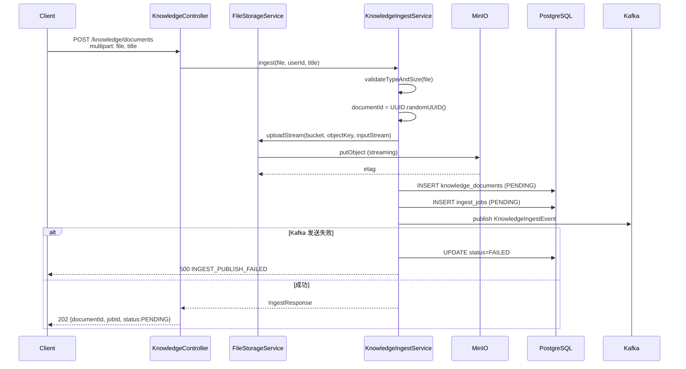
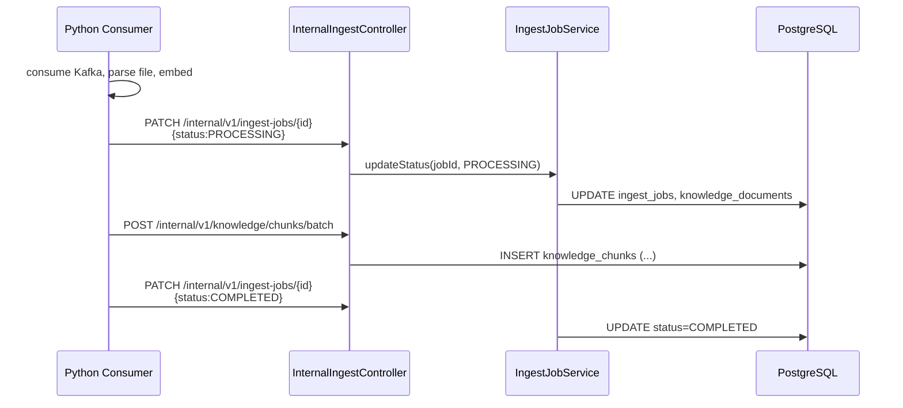
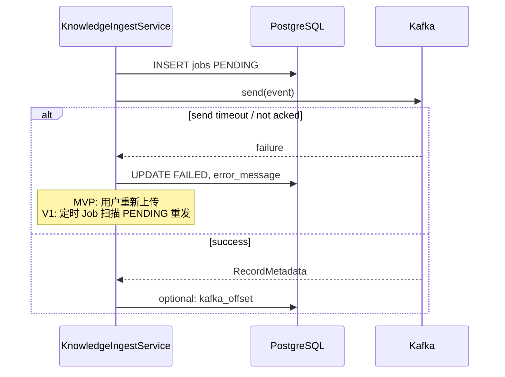

# 6.3 文件与调度模块（Java）

> 所属系统：DevOps AI Copilot — 控制面（Java Control Plane）  
> 模块定位：**大文件入口 + 异步任务调度器** — 接收知识库文档与大日志/Heap 文件，转存 MinIO，投递 Kafka，返回 202  
> 参考业界：S3 Presigned URL（AWS）、Dify Document Upload Pipeline、GitHub Actions artifact、事件驱动 Ingestion（Elasticsearch Ingest Pipeline 简化版）

---

## 1. 功能背景与边界

### 1.1 功能背景

DevOps 场景有两类「文件」需求，处理方式完全不同：

| 类型 | 例子 | 特征 |
|------|------|------|
| **知识库资产** | 状态码手册 PDF、故障复盘 Markdown | 需切块、向量化、长期 RAG 检索 |
| **分析输入** | 50MB Heap Dump、GC 日志、超大 app.log | 需离线解析特征、产出诊断摘要 |

共同点：

- 文件 **大**，不能长时间占用 Tomcat 线程  
- 文件 **本体** 不能进 PostgreSQL  
- 处理 **慢**（解析、Embedding），必须 **异步**  

本模块负责：**快速接收 → 可靠存储 → 登记任务 → 发事件 → 立刻 202 响应**，把重活交给 Python Consumer（6.4）。

### 1.2 模块职责（In Scope）

| 能力 | 说明 |
|------|------|
| MinIO 集成 | 客户端配置、bucket 管理、object_key 规范 |
| 知识文档上传 | 服务端 multipart 上传（MVP） |
| 预签名直传 | Presigned PUT URL（生产/大文件） |
| `knowledge_documents` 元数据 | 创建、状态查询、列表 |
| `ingest_jobs` 调度 | 创建、状态更新（含 Python 回调） |
| `analysis_jobs` 调度 | 大文件分析任务全生命周期 |
| Kafka 生产 | `knowledge_ingest_topic`、`analysis_ingest_topic` |
| 上传确认回调 | 直传完成后 `confirm` 接口 |
| Internal API | Python 更新 job/document 状态、批量写 chunk 的入口协调 |
| 上传限流 | 与 6.1 协作，按用户/IP 限制上传频率 |

### 1.3 模块边界（Out of Scope）

| 不属于本模块 | 归属 |
|--------------|------|
| PDF 解析、切块、Embedding | 6.4 RAG（Python Consumer） |
| Heap 解析算法 | 6.4 / 6.5 Python Worker |
| 向量检索 | 6.4 |
| 聊天 SSE | 6.2 |
| Kafka Consumer 实现 | Python 侧 |
| DLQ Consumer 运维 UI | V2 Admin |
| 病毒扫描、DLP | V2 安全 |

### 1.4 在系统中的位置

```text
Client ──► [6.3 文件与调度] ──► MinIO（文件本体）
                │
                ├──► PostgreSQL（documents / jobs 元数据）
                │
                └──► Kafka ──► Python Worker（6.4 消费）
                         │
                         └──► 回调 Internal API 更新状态 / 写 chunks
```

### 1.5 两条业务线区分（本模块入口）

```text
POST /api/v1/knowledge/documents     → knowledge_documents + ingest_jobs
POST /api/v1/analysis/jobs             → analysis_jobs

不靠扩展名自动猜；靠 API 路径 + 用户操作意图区分
```

---

## 2. 流程图

### 2.1 业务流程图：知识库文档上传（MVP 服务端上传）

```text
┌─────────────┐
│ 用户选择文件  │
│ 「上传到知识库」│
└──────┬──────┘
       ▼
┌─────────────┐  超限   ┌──────────────┐
│ 鉴权+上传限流 │──────►│ 429          │
└──────┬──────┘         └──────────────┘
       ▼
┌─────────────┐
│ 校验类型/大小 │
│ pdf,md,txt  │
│ ≤ 20MB MVP  │
└──────┬──────┘
       ▼
┌─────────────┐
│ 流式写 MinIO │
│ knowledge/  │
└──────┬──────┘
       ▼
┌─────────────┐
│ INSERT      │
│ documents   │ status=PENDING
│ ingest_jobs │ status=PENDING
└──────┬──────┘
       ▼
┌─────────────┐
│ Kafka send  │
│ (acks=all)  │
└──────┬──────┘
       ▼
┌─────────────┐
│ HTTP 202    │
│ {jobId,     │
│  documentId}│
└──────┬──────┘
       ▼
┌─────────────┐
│ 用户轮询状态  │
│ GET document│
└─────────────┘
```

### 2.2 业务流程图：大文件分析任务

```text
┌─────────────┐
│ 用户上传     │
│ heap/log    │
│ 「分析文件」  │
└──────┬──────┘
       ▼
┌─────────────┐
│ 校验类型     │
│ hprof,log   │
│ ≤ 100MB MVP │
└──────┬──────┘
       ▼
┌─────────────┐
│ 流式写 MinIO │
│ analysis/   │
└──────┬──────┘
       ▼
┌─────────────┐
│ INSERT      │
│ analysis_jobs│ PENDING
└──────┬──────┘
       ▼
┌─────────────┐
│ Kafka       │
│ analysis_topic│
└──────┬──────┘
       ▼
┌─────────────┐
│ HTTP 202    │
└──────┬──────┘
       ▼
┌─────────────┐
│ Python 解析  │
│ 写 summary  │
└──────┬──────┘
       ▼
┌─────────────┐
│ 用户在聊天中  │
│ 引用分析结果  │──► 6.2 读 analysis_jobs
└─────────────┘
```

### 2.3 业务流程图：预签名直传（生产路径）

```text
Client                    Java                     MinIO
  │ POST /upload/init        │                        │
  ├───────────────────────►│ 生成 documentId        │
  │                        │ 生成 object_key        │
  │◄─ presignedPutUrl ─────│                        │
  │                        │                        │
  │ PUT file ──────────────────────────────────────►│
  │                        │                        │
  │ POST /upload/confirm     │                        │
  ├───────────────────────►│ HEAD 校验 size/etag    │
  │                        │ INSERT + Kafka         │
  │◄─ 202 ─────────────────│                        │
```

### 2.4 时序图：知识库上传（MVP multipart）



### 2.5 时序图：Python 消费完成回调



### 2.6 时序图：Kafka 发送失败与重试（生产者侧）



---

## 3. 具体实现逻辑

### 3.1 技术栈总览

| 技术 | 用途 | 选型原因 |
|------|------|----------|
| **MinIO Java SDK** | S3 兼容对象存储 | 本地与生产 OSS/S3 API 一致；业界事实标准 |
| **Spring Kafka** | 事件发布 | 与 Spring 集成；`KafkaTemplate` + 事务性发件（可选） |
| **Apache Kafka** | 异步削峰 | 大文件处理解耦；Consumer 可水平扩展 |
| **MyBatis Plus** | documents/jobs CRUD | 与 6.2 一致 |
| **Servlet MultipartFile** | MVP 上传 | 简单；大文件改 presigned |
| **Commons IO / 流式拷贝** | 不缓冲全文件到内存 | 防止 OOM |
| **UUID** | documentId/jobId | 与 object_key 绑定 |

**业界对照**：

| 产品 | 做法 |
|------|------|
| Dify | Upload → Storage → Indexing Queue → Worker |
| Notion | Presigned S3 + async import |
| 日志平台 | Agent 上传 → Object Storage → Flink/Worker |

---

### 3.2 包结构建议

```text
com.devops.copilot.modules.file
├── controller/
│   ├── KnowledgeDocumentController.java
│   ├── AnalysisJobController.java
│   └── internal/
│       ├── InternalIngestController.java
│       └── InternalKnowledgeChunkController.java
├── service/
│   ├── FileStorageService.java
│   ├── KnowledgeIngestService.java
│   ├── AnalysisJobService.java
│   ├── IngestJobService.java
│   └── UploadPolicyService.java
├── kafka/
│   ├── KafkaTopics.java
│   ├── KnowledgeIngestProducer.java
│   ├── AnalysisIngestProducer.java
│   └── event/
│       ├── KnowledgeIngestEvent.java
│       └── AnalysisIngestEvent.java
├── config/
│   ├── MinioConfig.java
│   └── KafkaProducerConfig.java
├── domain/
│   └── entity/ KnowledgeDocument, IngestJob, AnalysisJob
└── mapper/
    └── ...
```

---

### 3.3 MinIO 存储设计

#### 3.3.1 Bucket 规划

| Bucket | 用途 | 访问 |
|--------|------|------|
| `devops-copilot` | 统一 bucket（MVP） | 私有 |
| 前缀 `knowledge/{documentId}/original.{ext}` | 知识库原文件 | |
| 前缀 `analysis/{jobId}/source.{ext}` | 分析源文件 | |
| 前缀 `analysis/{jobId}/result.json` | 分析结果 | |

V2：按环境分 bucket `devops-copilot-prod`。

#### 3.3.2 FileStorageService 核心逻辑

```java
public PutResult uploadStream(String objectKey, InputStream in, long size, String contentType) {
    minioClient.putObject(
        PutObjectArgs.builder()
            .bucket(properties.getBucket())
            .object(objectKey)
            .stream(in, size, -1)      // -1 = 未知 part size 时用 multipart 阈值
            .contentType(contentType)
            .build()
    );
    return new PutResult(objectKey, etag);
}

public String presignPutUrl(String objectKey, Duration expiry) {
    return minioClient.getPresignedObjectUrl(
        GetPresignedObjectUrlArgs.builder()
            .method(Method.PUT)
            .bucket(bucket)
            .object(objectKey)
            .expiry((int) expiry.toSeconds())
            .build()
    );
}

public StatObjectResponse stat(String objectKey) {
    return minioClient.statObject(...);  // confirm 时校验 size
}
```

**技术细节**：

- **流式上传**：`InputStream` 直接从 `MultipartFile.getInputStream()` 管道到 MinIO，**禁止** `file.getBytes()`  
- **Content-Type**：写入时保留，后续 Python 解析用  
- **选型原因**：MinIO S3 API 与阿里云 OSS/AWS S3 迁移成本极低  

---

### 3.4 上传策略（UploadPolicyService）

```java
public void validateKnowledgeUpload(String filename, long size, String contentType) {
    String ext = extension(filename);
    if (!ALLOWED_KNOWLEDGE_EXT.contains(ext))
        throw validationError("UNSUPPORTED_FILE_TYPE");
    if (size > properties.getKnowledgeMaxBytes())  // MVP: 20MB
        throw validationError("FILE_TOO_LARGE");
}

public void validateAnalysisUpload(...) {
    // MVP: hprof, log, txt; max 100MB
}
```

| 类型 | MVP 允许扩展名 | MVP 大小上限 |
|------|----------------|--------------|
| 知识库 | pdf, md, txt | 20 MB |
| 分析 | log, txt, hprof | 100 MB |

生产：MIME magic 检测防伪造扩展名；ClamAV 扫描。

---

### 3.5 知识库入库：KnowledgeIngestService

#### 3.5.1 API

| 方法 | 路径 | 响应 |
|------|------|------|
| POST | `/api/v1/knowledge/documents` | 202 |
| GET | `/api/v1/knowledge/documents` | 200 列表 |
| GET | `/api/v1/knowledge/documents/{id}` | 200 含 status |
| POST | `/api/v1/knowledge/documents/init-upload` | 200 presigned（V1） |
| POST | `/api/v1/knowledge/documents/{id}/confirm` | 202（V1） |

#### 3.5.2 ingest 事务边界

```java
@Transactional
public IngestResponse ingest(MultipartFile file, Long userId, String title) {
    uploadPolicy.validateKnowledgeUpload(...);

    UUID documentId = UUID.randomUUID();
    UUID jobId = UUID.randomUUID();
    String objectKey = "knowledge/" + documentId + "/original." + ext;

    // 1. 先传 MinIO（失败则不落库）
    fileStorage.uploadStream(objectKey, file.getInputStream(), file.getSize(), file.getContentType());

    // 2. 落库
    Long teamId = userService.getTeamId(userId);
    KnowledgeDocument doc = new KnowledgeDocument(documentId, userId, teamId, title, objectKey, ...);
    doc.setStatus(PENDING);
    documentMapper.insert(doc);

    IngestJob job = new IngestJob(jobId, documentId, PENDING);
    ingestJobMapper.insert(job);

    // 3. 发 Kafka（见 3.7）
    kafkaProducer.publishKnowledgeIngest(toEvent(doc, job));

    return new IngestResponse(documentId, jobId, PENDING);
}
```

**顺序说明**：业界两种做法：

| 顺序 | 优点 | 缺点 |
|------|------|------|
| **先 MinIO 后 DB**（推荐 MVP） | DB 里不会有无文件的脏记录 | MinIO 有孤儿文件需清理 Job |
| 先 DB 后 MinIO | 状态可追溯 | UPLOADING 中间态复杂 |

孤儿清理 V1：`orphan_objects` 扫描 MinIO 无 DB 记录超过 24h 的对象。

#### 3.5.3 Kafka 事件体

```json
{
  "eventId": "uuid",
  "eventType": "KNOWLEDGE_INGEST",
  "jobId": "uuid",
  "documentId": "uuid",
  "objectKey": "knowledge/.../original.pdf",
  "mimeType": "application/pdf",
  "userId": 1001,
  "teamId": 10,
  "traceId": "abc123",
  "createdAt": "2026-07-07T08:00:00Z"
}
```

- **Key** = `documentId`（同文档消息有序）  
- **Headers** = `traceId` 供 Consumer 续链  

---

### 3.6 大文件分析：AnalysisJobService

#### 3.6.1 API

| 方法 | 路径 | 响应 |
|------|------|------|
| POST | `/api/v1/analysis/jobs` | 202 |
| GET | `/api/v1/analysis/jobs/{id}` | 200 |
| GET | `/api/v1/analysis/jobs` | 200 列表 |

#### 3.6.2 创建逻辑

```java
public AnalysisJobResponse createAnalysisJob(MultipartFile file, Long userId, AnalysisFileType type) {
    uploadPolicy.validateAnalysisUpload(...);

    UUID jobId = UUID.randomUUID();
    String objectKey = "analysis/" + jobId + "/source." + ext;

    fileStorage.uploadStream(...);

    AnalysisJob job = new AnalysisJob(jobId, userId, objectKey, type, PENDING);
    analysisJobMapper.insert(job);

    kafkaProducer.publishAnalysisIngest(toEvent(job));

    return new AnalysisJobResponse(jobId, PENDING);
}
```

#### 3.6.3 与聊天的协作

6.2 Chat 时 Python Router 可：

```text
用户问「我上传的 heap 分析结果」
  → Tool 或 Java internal GET /internal/v1/analysis-jobs?userId=&latest=true
  → 读 result_summary 拼 context
```

Internal API：

```http
GET /internal/v1/analysis-jobs/{id}
PATCH /internal/v1/analysis-jobs/{id}  { status, resultSummary, resultObjectKey }
```

---

### 3.7 Kafka 生产者实现

#### 3.7.1 Topic 规划

| Topic | 用途 | 分区 MVP | Consumer |
|-------|------|----------|----------|
| `knowledge.ingest.v1` | 文档向量化 | 3 | Python ingest worker |
| `knowledge.ingest.dlq.v1` | 死信 | 1 | 人工/告警 |
| `analysis.ingest.v1` | 大文件分析 | 3 | Python analysis worker |

#### 3.7.2 生产者配置

```yaml
spring:
  kafka:
    producer:
      acks: all
      retries: 3
      enable-idempotence: true
      key-serializer: org.apache.kafka.common.serialization.StringSerializer
      value-serializer: org.springframework.kafka.support.serializer.JsonSerializer
```

```java
public void publishKnowledgeIngest(KnowledgeIngestEvent event) {
    kafkaTemplate.send(TOPIC, event.getDocumentId().toString(), event)
        .whenComplete((result, ex) -> {
            if (ex != null) {
                ingestJobService.markFailed(event.getJobId(), "KAFKA_PUBLISH_FAILED");
                throw new IngestException(...);
            }
            // optional: save offset
        });
}
```

**选型原因**：

- `acks=all`：消息不丢（broker 确认）  
- `enable.idempotence`：生产者重试不重复  
- 与 **Consumer 幂等**（jobId）配合实现端到端至少一次  

**业界对照**：Transactional Outbox 模式 — MVP 直接发 Kafka；生产高可靠场景用 **Outbox 表 + 定时投递**。

#### 3.7.3 DLQ 策略（定义在本模块，消费在 Python）

```text
Python Consumer 处理失败:
  retry_count < 3 → 重新消费（固定间隔）
  retry_count >= 3 → publish to knowledge.ingest.dlq.v1
  PATCH Java: status=FAILED, error_message
```

Java 侧：

- 记录 `ingest_jobs.retry_count`  
- Admin 可提供 `POST /admin/ingest-jobs/{id}/retry` 重新发 Kafka（V1）  
- **MVP 补偿 Job**：每 5min 扫描 `status=PENDING` 且 `created_at < now()-5min` 的 job，重新 publish；仍失败则 `FAILED`  

---

### 3.8 Internal API（Python 回调）

| 方法 | 路径 | 说明 |
|------|------|------|
| PATCH | `/internal/v1/ingest-jobs/{id}` | 更新 status、error_message、retry_count |
| PATCH | `/internal/v1/knowledge/documents/{id}` | 同步 document.status |
| POST | `/internal/v1/knowledge/chunks/batch` | 批量插入 chunks |
| DELETE | `/internal/v1/knowledge/documents/{id}/chunks` | 重新入库前清空（V1） |
| PATCH | `/internal/v1/analysis-jobs/{id}` | 更新分析结果 |

#### chunks/batch 请求体

```json
{
  "documentId": "uuid",
  "chunks": [
    {
      "chunkIndex": 0,
      "content": "...",
      "embedding": [0.1, 0.2, ...],
      "metadata": { "page": 1 }
    }
  ]
}
```

**实现选择**：

| 方案 | 说明 |
|------|------|
| **A. Java 写 pgvector（推荐）** | Python 不算 DB 权限；Java 校验 document 存在后 INSERT |
| B. Python 直连 PG | 违反架构 P2；不推荐 |

Java 批量插入：

```java
@Transactional
public void batchInsertChunks(UUID documentId, List<ChunkDTO> chunks) {
    documentService.ensureExists(documentId);
    chunkMapper.deleteByDocumentId(documentId); // 重入库场景
    chunkMapper.insertBatch(chunks);            // MyBatis foreach batch
}
```

**embedding 写入**：MyBatis `INSERT ... vector` 或用 PG JDBC `PGobject`。

---

### 3.9 状态机实现

#### knowledge_documents / ingest_jobs 同步更新

```java
public void updateIngestStatus(UUID jobId, IngestStatus status, String error) {
    IngestJob job = ingestJobMapper.selectById(jobId);
    job.setStatus(status);
    job.setErrorMessage(error);
    job.setUpdatedAt(now());
    ingestJobMapper.updateById(job);

    KnowledgeDocument doc = documentMapper.selectById(job.getDocumentId());
    doc.setStatus(mapToDocStatus(status));
    doc.setErrorMessage(error);
    documentMapper.updateById(doc);
}
```

| ingest_jobs | knowledge_documents |
|-------------|---------------------|
| PENDING | PENDING |
| PROCESSING | PROCESSING |
| COMPLETED | COMPLETED |
| FAILED | FAILED |

**权威来源**：以 `ingest_jobs` 为流水线真相；`documents.status` 为 **用户展示镜像**。

#### analysis_jobs 独立状态机

```text
PENDING → PROCESSING → COMPLETED
              └──────► FAILED
```

---

### 3.10 查询 API 实现

```java
// GET /knowledge/documents?page=1&size=20
public Page<KnowledgeDocumentDTO> list(Long userId, PageQuery q) {
    return documentMapper.selectPage(userId, q);
}

// GET /knowledge/documents/{id}
public KnowledgeDocumentDTO get(Long userId, UUID id) {
    KnowledgeDocument doc = documentMapper.selectById(id);
    if (!doc.getUserId().equals(userId)) throw forbidden();
    return toDTO(doc);  // 含 status, errorMessage, 不含 object_key 给前端
}
```

前端轮询：每 2~3s 查 status，直到 `COMPLETED` / `FAILED`。

---

### 3.11 限流与安全

| 点 | 实现 |
|----|------|
| 上传频率 | `ratelimit:upload:user:{id}` 10次/小时（Redis） |
| 文件类型 | 扩展名 + MVP 信任；生产 MIME sniff |
| object_key | 不暴露给前端；下载走 presigned GET（V1） |
| 归属 | 文档列表按 userId；**RAG 检索按 teamId 共享**（见 6.4） |
| 内网回调 | Service Token（6.1） |

---

### 3.12 与 6.2 的协作：分析结果导入知识库（V1 扩展入口）

```text
POST /api/v1/knowledge/documents/from-analysis/{analysisJobId}
  1. 校验 analysis_job 归属且 COMPLETED
  2. 复制 MinIO result.json → knowledge/{newDocId}/
  3. 走标准 ingest 流程
```

实现 **「分析完再加入知识库」** 而不混表。

---

## 4. 可扩展方案

### 4.1 上传路径扩展

| 阶段 | 方案 |
|------|------|
| MVP | Multipart 服务端流式上传 |
| V1 | Presigned PUT 直传 MinIO |
| V2 | 分片上传 Multipart Upload（S3 API） |
| V2 | 断点续传（tus.io 协议） |

### 4.2 调度扩展

| 扩展 | 方案 |
|------|------|
| Outbox 模式 | `outbox_events` 表 + Debezium/定时器发 Kafka |
| 优先级队列 | 高优 topic `knowledge.ingest.priority` |
| 延迟重试 | Kafka retry topic + `retry_at` |
| 工作流编排 | Temporal/Cadence 管长任务（生产级） |
| 定时 re-ingest | 文档更新版本 `document_version` |

### 4.3 存储扩展

| 扩展 | 方案 |
|------|------|
| 云 OSS | 换 endpoint + accessKey，代码不变 |
| CDN | 静态知识附件只读分发 |
| 生命周期 | MinIO ILM：90 天未访问转冷存储 |
| 加密 | SSE-S3 服务端加密 |

### 4.4 多租户扩展

```text
object_key: tenant/{teamId}/knowledge/{documentId}/...
Kafka header: teamId
配额: 按 team 限制总存储量
```

---

## 5. MVP vs 生产：技术差距清单

| 能力 | MVP | 生产 | 风险 |
|------|-----|------|------|
| 上传方式 | Multipart 经 Java | Presigned 直传 | Java 带宽与内存瓶颈 |
| 文件大小 | 20MB / 100MB | 分片 5GB+ | 大单文件失败 |
| 病毒扫描 | 无 | ClamAV / 云扫描 | 恶意文件 |
| MIME 校验 | 扩展名 | Tika magic bytes | 伪装扩展名 |
| MVP 补偿 | 5min 定时 Job 重发 PENDING 超时消息 | Transactional Outbox | DB 有记录无消息 |
| 孤儿文件 | 无清理 | 定时 sweeper | MinIO 成本 |
| DLQ | Topic 有，人工处理 | 告警 + Admin 重试 UI | 任务静默失败 |
| Consumer 幂等 | 约定 jobId | Redis dedup + DB unique | 重复 chunk |
| chunk 写入 | JDBC batch | COPY + 专用连接池 | 大批量慢 |
| 重新入库 | 全删再插 | 版本 diff 增量 | 向量冗余 |
| 预签名 URL | 无 | PUT/GET 分离权限 | 链接泄漏 |
| 存储配额 | 无 | per-team 容量上限 | 磁盘打满 |
| 加密 | HTTP 内网 | TLS everywhere + at-rest | 合规 |
| 分析解析 | 简化关键字提取 | MAT / ELK 对接 | 诊断质量 |
| 进度反馈 | 轮询 status | SSE/WebSocket 进度条 | UX |
| 监控 | 日志 | `ingest_lag`、`job_duration` 指标 | 积压不可见 |

---

## 6. 模块交付验收标准（MVP）

| # | 验收项 |
|---|--------|
| 1 | 上传 PDF 到知识库返回 202，含 `documentId`、`jobId` |
| 2 | MinIO 存在对应 `object_key` |
| 3 | DB `knowledge_documents`、`ingest_jobs` 均为 PENDING |
| 4 | Kafka topic 收到 `KNOWLEDGE_INGEST` 消息 |
| 5 | Python 回调后 status 变 COMPLETED，chunks 可查询 |
| 6 | 上传 heap/log 走 `analysis_jobs`，不进 knowledge_documents |
| 7 | 超大文件 / 非法扩展名返回 400 |
| 8 | 他人 documentId 查询返回 403 |
| 9 | Kafka 发送失败时 job 标 FAILED，不留下 COMPLETED 假象 |
| 10 | 上传过程不使用 `getBytes()` 全量读入内存（代码审查） |

---

## 7. 与其他模块的接口约定

| 模块 | 交互 |
|------|------|
| 6.1 | JWT 身份；上传限流；Internal Service Token |
| 6.2 | 聊天引用 `analysis_jobs.result_summary`；不在本模块处理消息 |
| 6.4 | 消费 Kafka；回调 chunks batch + status PATCH |
| 6.5 | analysis worker 可走同一 Python 进程不同 consumer group |
| 6.7 | 指标：`ingest_jobs_total`、`kafka_publish_failures`、`upload_duration_seconds` |

---

## 8. 关键配置示例

```yaml
file:
  knowledge:
    max-bytes: 20971520          # 20MB
    allowed-extensions: [pdf, md, txt]
  analysis:
    max-bytes: 104857600         # 100MB
    allowed-extensions: [log, txt, hprof]
  upload-rate-limit-per-hour: 10

minio:
  endpoint: http://minio:9000
  bucket: devops-copilot
  access-key: ${MINIO_ACCESS_KEY}
  secret-key: ${MINIO_SECRET_KEY}

kafka:
  topics:
    knowledge-ingest: knowledge.ingest.v1
    analysis-ingest: analysis.ingest.v1
    knowledge-dlq: knowledge.ingest.dlq.v1
```

---

**6.3 文件与调度模块（Java）** 已全部细化完毕。
