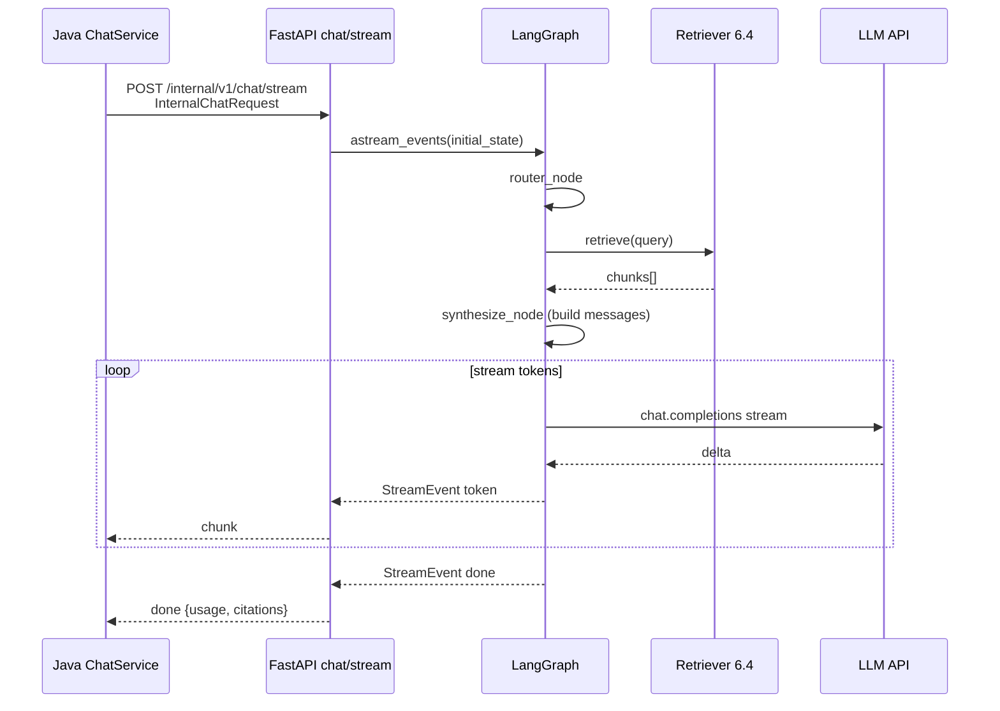
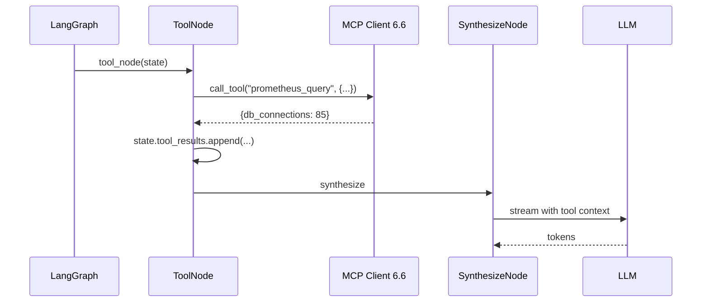
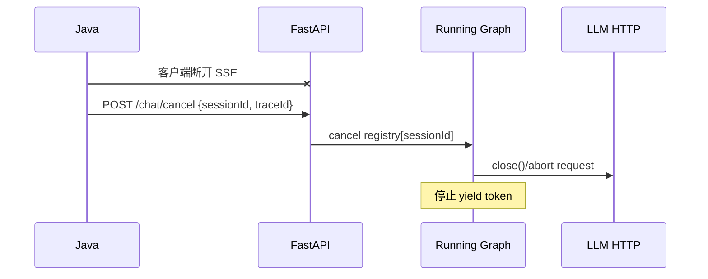

# 6.5 智能体编排模块（Python / LangGraph）

> 所属系统：DevOps AI Copilot — 智能面（Python AI Plane）  
> 模块定位：**AI 诊断的「执行引擎」** — 用 LangGraph 硬编码 DAG 编排路由、RAG、Tool、LLM 流式合成，并对外提供 `/internal/v1/chat/stream`  
> 参考业界：LangGraph StateGraph、Dify Workflow Engine（简化版）、OpenAI Assistants Run Loop、Semantic Kernel Planner（轻量）

---

## 1. 功能背景与边界

### 1.1 功能背景

单次用户提问在 DevOps 场景下往往不是「直接问 LLM」：

```text
「STATUS_899 是什么？」        → 需要 RAG 查内部字典
「当前 DB 连接数正常吗？」      → 需要 MCP 拉实时指标
「你好」                       → 可直接 LLM
「我上传的 heap 分析结果呢？」   → 需要读 analysis_job 结果
```

若把所有逻辑写在一个 `if-else` 或单次 prompt 里，会难以维护、难以扩展、难以测试。

**智能体编排模块** 用 **有向无环图（DAG）状态机** 把步骤拆开：

- **路由**：决定走哪条能力链  
- **检索 / 工具**：拉外部上下文  
- **合成**：统一流式调 LLM 输出  

并与 Java 控制面通过 **HTTP 流式** 对接（6.2 SSE 终点在 Java）。

### 1.2 模块职责（In Scope）

| 能力 | 说明 |
|------|------|
| LangGraph 图定义 | 硬编码诊断 DAG |
| State 管理 | `DiagnosisState` 在各节点间传递 |
| RouterNode | 意图分类（规则 + 可选 LLM） |
| RetrieveNode | 调用 6.4 Retriever |
| ToolNode | 调用 6.6 MCP Client |
| AnalysisLookupNode | 读 analysis_job 摘要（MVP 可合并进 ToolNode） |
| SynthesizeNode | 拼 prompt + **流式 LLM** |
| Redis Checkpoint | 会话级图状态短期记忆 |
| HTTP API | `POST /internal/v1/chat/stream`、`POST /internal/v1/chat/cancel` |
| 流式事件协议 | token / citation / done / error **NDJSON**（对内）；Java 转 SSE（对外） |
| Service Token 校验 | 仅接受 Java 调用 |
| 取消传播 | abort LLM 上游请求 |

### 1.3 模块边界（Out of Scope）

| 不属于本模块 | 归属 |
|--------------|------|
| JWT 用户鉴权 | 6.1 Java |
| Message 落库、SSE 对客户端 | 6.2 Java |
| 向量入库管道 | 6.4 Ingest Consumer |
| MCP Server 实现 | 6.6 / 外部 |
| Kafka 消费 | 6.4 / analysis worker |
| Agent CRUD | 6.2 Java |
| 复杂多 Agent 协作、人机审批 | V2 |

### 1.4 在系统中的位置

```text
[6.2 Java ChatService]
        │ WebClient stream
        ▼
[6.5 FastAPI /internal/v1/chat/stream]
        │
        ▼
[LangGraph Compiled Graph]
        │
        ├──► [6.4 Retriever] ──► pgvector
        ├──► [6.6 MCP Client] ──► Prometheus/SQL Mock
        ├──► [Java Internal API] ──► analysis_jobs / messages
        └──► LLM API (stream)
```

### 1.5 MVP 图结构（硬编码）

```text
START → router → ┬─► retrieve ──────────────┐
                 ├─► tool ─────────────────┤
                 ├─► fan_out (retrieve∥tool) ─┤─► synthesize → END
                 ├─► analysis ─────────────┤
                 └─► direct ───────────────┘
```

| intent | 下一节点 | 说明 |
|--------|----------|------|
| `rag` | retrieve → synthesize | 仅知识检索 |
| `tool` | tool → synthesize | 仅 MCP 实时查数 |
| `rag_and_tool` | fan_out → synthesize | retrieve 与 tool **并行**（`asyncio.gather`） |
| `analysis` | analysis → synthesize | 查 analysis_job |
| `direct` | synthesize | 跳过检索与工具 |

`direct`：跳过 retrieve/tool，直接 synthesize（仍走同一 LLM 节点）。

**V1 扩展**：`rag_then_tool` 串行路径（后一步依赖前一步结果时使用）。

---

## 2. 流程图

### 2.1 业务流程图：单次诊断编排

```text
┌──────────────┐
│ 收到          │
│ InternalChat │
│ Request      │
│ + history    │  ← 对话上下文来自 Java PG，非 Redis
└──────┬───────┘
       ▼
┌──────────────┐
│ RouterNode   │
│ 判定 intent  │
└──────┬───────┘
       │
   ┌───┼───┬──────────┬────────────┐
   ▼   ▼   ▼          ▼            ▼
 rag tool rag_and_tool analysis   direct
   │   │   │(并行)      │            │
   └───┴───┴─────┬──────┴────────────┘
                 ▼
         ┌──────────────┐
         │ SynthesizeNode│
         │ stream LLM   │
         └──────┬───────┘
                ▼
         ┌──────────────┐
         │ 输出 done     │
         │ (NDJSON)      │
         └──────────────┘
```

### 2.2 业务流程图：Router 决策（MVP 规则）

```text
user_message 文本匹配（按优先级）
      │
      ├─ 含「分析结果」「heap」「上传的文件」→ intent=analysis
      ├─ 同时命中 RAG 词 AND Tool 词 → intent=rag_and_tool（并行 FanOut）
      ├─ 仅含「当前」「现在」「连接数」「CPU」「QPS」→ intent=tool
      ├─ 仅含「STATUS_」「错误码」「为什么」「原因」→ intent=rag
      ├─ enable_rag=false → intent=direct
      └─ 默认 → intent=rag（运维场景偏向查知识）

V1：含「根据」「按照手册」「排查步骤」→ `rag_then_tool`（串行：retrieve → tool → synthesize）
```

### 2.3 时序图：端到端流式（Java → Python → LLM）



### 2.4 时序图：Tool 路径（含 MCP）



### 2.5 时序图：取消



---

## 3. 具体实现逻辑

### 3.1 技术栈总览

| 技术 | 用途 | 选型原因 |
|------|------|----------|
| **LangGraph** | 状态图编排 | 比裸 LangChain Agent 更可控；checkpoint 内置支持 |
| **LangChain Core** | Message 类型、部分工具抽象 | 与 LangGraph 配套 |
| **FastAPI** | HTTP 入口 | 异步、流式 `StreamingResponse` |
| **OpenAI Python SDK** | LLM 流式 | 兼容 DeepSeek/Qwen |
| **Redis** | Checkpoint 存储 | 快、TTL；LangGraph `RedisSaver` 或自研 |
| **httpx** | 调 Java Internal API | analysis 查询、可选 message 拉取 |
| **pydantic** | State / Request 模型 | 类型安全 |
| **structlog** | 结构化日志 | trace_id 贯穿 |
| **asyncio** | 并发与取消 | `asyncio.Task` + cancel event |

**业界对照**：

| 方案 | 特点 |
|------|------|
| LangGraph | 显式图 + 状态，适合 **硬编码业务流程** |
| AutoGPT / ReAct 循环 | 灵活但难控，不适合企业 MVP |
| Dify Workflow | 可视化；你是代码版简化 DAG |
| **选型结论** | DevOps 诊断路径 **已知**，硬编码图比自主 Agent 更合适 |

---

### 3.2 包结构建议

```text
ai_plane/app/agent/
├── api/
│   ├── chat.py                 # /internal/v1/chat/stream, cancel
│   └── deps.py                 # service token 校验
├── graph/
│   ├── builder.py              # 构图 + compile
│   ├── state.py                # DiagnosisState
│   └── nodes/
│       ├── router.py
│       ├── retrieve.py
│       ├── tool.py
│       ├── analysis.py
│       └── synthesize.py
├── checkpoint/
│   └── redis_saver.py
├── llm/
│   ├── llm_client.py
│   └── prompt_builder.py
├── streaming/
│   ├── event_emitter.py
│   └── cancel_registry.py
├── models/
│   ├── internal_chat_request.py
│   └── stream_event.py
└── config.py
```

---

### 3.3 核心数据模型

#### 3.3.1 InternalChatRequest（与 6.2 对齐）

```python
class AgentConfig(BaseModel):
    model: str
    system_prompt: str
    enable_rag: bool = True
    enable_mcp: bool = True
    rag_top_k: int = 5
    rag_score_threshold: float = 0.7
    temperature: float = 0.2
    max_history_messages: int = 20
    mcp_servers: list[str] = []
    llm_timeout_seconds: int = 60

class ChatMessage(BaseModel):
    role: Literal["user", "assistant", "system"]
    content: str

class UserContext(BaseModel):
    user_id: int
    team_id: int

class InternalChatRequest(BaseModel):
    trace_id: str
    session_id: str
    user_message: str
    history: list[ChatMessage]
    agent_config: AgentConfig
    user_context: UserContext
```

Java 已落库当前 `user_message`。**约定（P7）**：`history` = 最近 N 条 **不含本条**；当前轮仅走 `userMessage` 字段，避免 prompt 重复。

#### 3.3.2 DiagnosisState（LangGraph State）

```python
class DiagnosisState(TypedDict):
    # 输入
    trace_id: str
    session_id: str
    user_message: str
    history: list[dict]
    agent_config: dict
    user_context: dict

    # 路由
    intent: str  # rag | tool | rag_and_tool | analysis | direct

    # 中间结果
    retrieved_chunks: list[dict]
    tool_results: list[dict]
    analysis_summary: str | None

    # 输出
    final_answer: str
    citations: list[dict]
    usage: dict
    error: str | None
```

LangGraph 用 `Annotated` + `reducer` 若需追加列表；MVP 每轮 **覆盖式** 更新即可。

#### 3.3.3 StreamEvent（Python → Java）

```python
class StreamEvent(BaseModel):
    type: Literal["token", "citation", "done", "error"]
    text: str | None = None
    citations: list[dict] | None = None
    done: dict | None = None      # usage, model, latency_ms
    error: dict | None = None     # code, message
```

序列化：**NDJSON** 每行一个 JSON（`Content-Type: application/x-ndjson`）。Java WebClient 按行解析后转为对客户端的 SSE。

```text
{"type":"citation","citations":[...]}
{"type":"token","text":"根据"}
{"type":"done","done":{"usage":{...}}}
```

---

### 3.4 LangGraph 图构建（builder.py）

```python
from langgraph.graph import StateGraph, END

def build_diagnosis_graph():
    g = StateGraph(DiagnosisState)

    g.add_node("router", router_node)
    g.add_node("retrieve", retrieve_node)
    g.add_node("tool", tool_node)
    g.add_node("fan_out", fan_out_node)          # rag_and_tool: asyncio.gather(retrieve, tool)
    g.add_node("analysis", analysis_lookup_node)
    g.add_node("synthesize", synthesize_node)

    g.set_entry_point("router")

    g.add_conditional_edges(
        "router",
        route_by_intent,
        {
            "rag": "retrieve",
            "tool": "tool",
            "rag_and_tool": "fan_out",
            "analysis": "analysis",
            "direct": "synthesize",
        },
    )
    g.add_edge("retrieve", "synthesize")
    g.add_edge("tool", "synthesize")
    g.add_edge("fan_out", "synthesize")
    g.add_edge("analysis", "synthesize")
    g.add_edge("synthesize", END)

    # MVP：不启用 checkpointer；对话上下文由 Java history 提供
    return g.compile()
```

**为何不用循环图**：MVP 单次 retrieve/tool 或并行 fan_out → synthesize 足够。V2 可加 `should_continue` 边实现 ReAct 多轮。

#### fan_out_node（rag_and_tool 并行）

```python
async def fan_out_node(state: DiagnosisState) -> DiagnosisState:
    """无依赖的 RAG + MCP 并行执行，总延迟 ≈ max(retrieve, tool)。"""
    retrieve_state, tool_state = await asyncio.gather(
        retrieve_node(dict(state)),
        tool_node(dict(state)),
    )
    state["retrieved_chunks"] = retrieve_state.get("retrieved_chunks", [])
    state["tool_results"] = tool_state.get("tool_results", [])
    return state
```

---

### 3.5 各 Node 实现逻辑

#### 3.5.1 RouterNode（router.py）

**MVP：规则优先（可测、无额外 LLM 成本）**

```python
RAG_PATTERNS = [r"STATUS_\d+", r"错误码", r"为什么", r"原因", r"故障"]
TOOL_PATTERNS = [r"当前", r"现在", r"连接数", r"CPU", r"QPS", r"内存"]
ANALYSIS_PATTERNS = [r"分析结果", r"heap", r"上传的", r"dump"]

def _matches(patterns, msg):
    return any(re.search(p, msg) for p in patterns)

def router_node(state: DiagnosisState) -> DiagnosisState:
    msg = state["user_message"]
    cfg = state["agent_config"]

    if any(re.search(p, msg) for p in ANALYSIS_PATTERNS):
        state["intent"] = "analysis"
    elif cfg.get("enable_rag") and cfg.get("enable_mcp") and _matches(RAG_PATTERNS, msg) and _matches(TOOL_PATTERNS, msg):
        state["intent"] = "rag_and_tool"
    elif cfg.get("enable_mcp") and _matches(TOOL_PATTERNS, msg):
        state["intent"] = "tool"
    elif cfg.get("enable_rag") and _matches(RAG_PATTERNS, msg):
        state["intent"] = "rag"
    elif cfg.get("enable_rag"):
        state["intent"] = "rag"
    else:
        state["intent"] = "direct"
    return state
```

**V1 扩展 `rag_then_tool`**（串行，后一步依赖前一步）：

```python
DEPENDENCY_PATTERNS = [r"根据", r"按照.*手册", r"排查步骤"]
# 在 analysis 判断之后、rag_and_tool 之前：
elif _matches(DEPENDENCY_PATTERNS, msg) and cfg.get("enable_rag") and cfg.get("enable_mcp"):
    state["intent"] = "rag_then_tool"
```

图结构增加：`retrieve → tool → synthesize`（V1）。

**V1.1 增强**：规则未命中时调 **小模型分类**（单次非流式，~100 tokens）。

```python
# classify_intent_llm(user_message) -> rag|tool|analysis|direct
```

#### 3.5.2 RetrieveNode（retrieve.py）

```python
async def retrieve_node(state: DiagnosisState) -> DiagnosisState:
    cfg = state["agent_config"]
    hits = await retriever_service.retrieve(
        query=state["user_message"],
        top_k=cfg["rag_top_k"],
        score_threshold=cfg["rag_score_threshold"],
    )
    state["retrieved_chunks"] = [h.model_dump() for h in hits]
    return state
```

检索完成后可 **提前发 citation 事件**（在 synthesize 流式开始前，由 API 层在 node 完成后 emit）。

#### 3.5.3 ToolNode（tool.py）

```python
async def tool_node(state: DiagnosisState) -> DiagnosisState:
    cfg = state["agent_config"]
    query = infer_promql_or_tool_name(state["user_message"])  # MVP 规则映射

  results = []
    if "连接数" in state["user_message"]:
        res = await mcp_client.call_tool(
            server="prometheus",
            name="prometheus_query",
            arguments={"query": "db_connections"},  # MVP 固定 query
        )
        results.append({"tool": "prometheus_query", "result": res})

    state["tool_results"] = results
    return state
```

MVP：**关键词 → 固定 Tool 调用**；V1 用 LLM function calling 选 tool。

#### 3.5.4 AnalysisLookupNode（analysis.py）

```python
async def analysis_lookup_node(state: DiagnosisState) -> DiagnosisState:
    job = await java_client.get_latest_analysis_job(
        user_id=state["user_context"]["user_id"],
        status="COMPLETED",
    )
    state["analysis_summary"] = job.result_summary if job else None
    return state
```

#### 3.5.5 SynthesizeNode（synthesize.py）— **核心**

**Prompt 构建（prompt_builder.py）**

```python
def build_messages(state: DiagnosisState) -> list[dict]:
    system = state["agent_config"]["system_prompt"]
    system += """

你必须遵守：
1. 仅基于提供的【内部知识】【实时数据】【分析结果】回答，不得编造。
2. 若上下文不足，明确说明「内部资料未覆盖」。
3. 引用知识时使用 [n] 标注。
"""

    context_blocks = []

    for i, c in enumerate(state.get("retrieved_chunks") or [], 1):
        context_blocks.append(
            f"[{i}] (来源: {c['document_title']}, score={c['score']:.2f})\n{c['content']}"
        )

    for t in state.get("tool_results") or []:
        context_blocks.append(f"【实时数据】{t['tool']}: {json.dumps(t['result'], ensure_ascii=False)}")

    if state.get("analysis_summary"):
        context_blocks.append(f"【文件分析结果】\n{state['analysis_summary']}")

    context_text = "\n\n".join(context_blocks) if context_blocks else "（无额外上下文）"

    messages = [{"role": "system", "content": system}]
    for h in state["history"]:
        messages.append({"role": h["role"], "content": h["content"]})
    messages.append({
        "role": "user",
        "content": f"上下文：\n{context_text}\n\n用户问题：{state['user_message']}",
    })
    return messages
```

**流式 LLM（llm_client.py）**

```python
async def stream_chat(messages, model, temperature, cancel_event: asyncio.Event):
    client = AsyncOpenAI(base_url=..., api_key=...)
    stream = await client.chat.completions.create(
        model=model,
        messages=messages,
        temperature=temperature,
        stream=True,
        timeout=settings.LLM_TIMEOUT,
    )
    full = []
    usage = {}
    async for chunk in stream:
        if cancel_event.is_set():
            await stream.close()
            break
        delta = chunk.choices[0].delta.content
        if delta:
            full.append(delta)
            yield {"type": "token", "text": delta}
        # 最后一包可能带 usage（视厂商而定）
    yield {"type": "internal_complete", "full_text": "".join(full), "usage": usage}
```

**注意**：`synthesize` 在 LangGraph 里若要做流式，有两种模式：

| 模式 | 做法 | MVP |
|------|------|-----|
| **A. 图外 LLM 流式（正式选型）** | `graph.ainvoke` 跑完前置节点，API 层 `build_messages` + `stream_chat` | ✅ |
| B. 图内流式 | `astream_events` 监听 LLM 事件 | V1 |

**MVP 采用模式 A**：

```python
async def run_diagnosis_stream(req: InternalChatRequest):
    state = init_state(req)  # history 不含本条 userMessage
    state = await graph.ainvoke(state)
    messages = build_messages(state)
    async for evt in stream_chat(...):
        yield evt
    yield {"type": "done", "done": {...}, "citations": build_citations(state)}
```

---

### 3.6 FastAPI 端点实现（chat.py）

```python
@router.post("/internal/v1/chat/stream")
async def chat_stream(
    req: InternalChatRequest,
    _: None = Depends(verify_service_token),
):
    cancel_event = cancel_registry.register(req.session_id)

    async def event_generator():
        try:
            async for event in orchestrator.run(req, cancel_event):
                yield json.dumps(event, ensure_ascii=False) + "\n"
        except Exception as e:
            yield json.dumps({"type": "error", "error": {"code": "AGENT_ERROR", "message": str(e)}}) + "\n"
        finally:
            cancel_registry.unregister(req.session_id)

    return StreamingResponse(
        event_generator(),
        media_type="application/x-ndjson",
    )

@router.post("/internal/v1/chat/cancel")
async def chat_cancel(body: CancelRequest, _: None = Depends(verify_service_token)):
    cancel_registry.cancel(body.session_id)
    return {"ok": True}
```

**超时**：`asyncio.wait_for` 包裹整段生成，超时 yield error `LLM_TIMEOUT`。

---

### 3.7 对话上下文与 Redis Checkpoint（P7）

#### 唯一真相源：PostgreSQL messages

| 数据 | 存储位置 | 说明 |
|------|----------|------|
| 多轮对话历史 | PG `messages` 表 | Java 每轮查最近 N 条，经 `InternalChatRequest.history` 传入 |
| 本轮产出（citations、toolCalls、usage、intent） | PG `messages.metadata_json` | 流结束后由 Java 从 `done` 事件写入 assistant 行 |
| 图运行中间态 | **MVP 不持久化到 Redis** | 当轮在内存 state 中流转即可 |

**原则**：每轮 Python 以 Java 传入的 `history` **覆盖初始化** state，不读取 Redis 中的 messages。避免 PG 与 Redis 双源冲突。

#### Redis Checkpoint（V2 可选）

| 存什么 | 不存什么 |
|--------|----------|
| 多步 Tool 中断恢复时的 node 进度 | 完整 messages（在 Java PG） |
| 未完成的 tool_results（跨请求续跑） | 流式 half-token |

```python
# V2 可选：LangGraph RedisSaver
class RedisCheckpointSaver:
    def put(self, thread_id: str, checkpoint: dict):
        redis.setex(f"lg:checkpoint:{thread_id}", 7 * 86400, json.dumps(checkpoint))

    def get(self, thread_id: str) -> dict | None:
        raw = redis.get(f"lg:checkpoint:{thread_id}")
        return json.loads(raw) if raw else None
```

**MVP**：`g.compile()` **不挂 checkpointer**；`history` + `metadata_json` 已满足多轮对话与审计需求。

---

### 3.8 取消注册表（cancel_registry.py）

```python
class CancelRegistry:
    def __init__(self):
        self._events: dict[str, asyncio.Event] = {}

    def register(self, session_id: str) -> asyncio.Event:
        ev = asyncio.Event()
        self._events[session_id] = ev
        return ev

    def cancel(self, session_id: str):
        if session_id in self._events:
            self._events[session_id].set()

    def unregister(self, session_id: str):
        self._events.pop(session_id, None)
```

Java 在 `SseEmitter.onCompletion` 调 `/chat/cancel`。

---

### 3.9 与 6.2 的事件对齐（done 载荷）

```json
{
  "type": "done",
  "done": {
    "usage": { "promptTokens": 1200, "completionTokens": 340 },
    "model": "deepseek-chat",
    "latencyMs": 3200,
    "intent": "rag"
  },
  "citations": [
    { "chunkId": "...", "documentTitle": "状态码字典", "score": 0.89 }
  ]
}
```

Java 解析后写入 `messages.metadata_json` 并 SSE `event:done` 给客户端。

---

### 3.10 错误处理

| 场景 | 行为 | 错误码 |
|------|------|--------|
| RAG 空结果 | 继续 synthesize，prompt 声明无知识 | — |
| MCP 超时 | `tool_results=[{error}]`，LLM 如实说明 | — |
| LLM 429 | 重试 1 次，仍失败 → error 事件 | `LLM_RATE_LIMIT` |
| LLM 超时 | cancel + error | `LLM_TIMEOUT` |
| Java internal 失败 | analysis 节点 summary=null | — |

**原则**：非致命失败 **降级**，不直接 500 断流（除非整个图崩溃）。

---

## 4. 可扩展方案

### 4.1 图结构扩展

| 阶段 | 扩展 |
|------|------|
| MVP | 单轮 + `rag_and_tool` 并行 fan_out |
| V1 | **rag_then_tool 串行**：retrieve → tool → synthesize |
| V1 | **ReAct 环**：synthesize 后 `should_call_tool` 回 tool（最多 3 轮） |
| V2 | 子图：专门「日志分析」子流程 |
| V2 | 人工审批节点：敏感操作暂停等人确认 |

```text
V1 ReAct 示意：
router → tool → synthesize → [need_more?] → tool → synthesize → END
```

### 4.2 Router 扩展

| 方案 | 说明 |
|------|------|
| 规则 | MVP |
| LLM 分类 | 小模型 intent |
| Embedding 意图库 | 预置意图例句向量匹配 |

### 4.3 LLM 扩展

| 扩展 | 方案 |
|------|------|
| 多模型路由 | 简单问题用小模型，复杂用 DeepSeek |
| Function Calling | ToolNode 改 OpenAI tools 参数 |
| 结构化输出 | `response_format=json` 输出诊断单 |

### 4.4 状态与记忆扩展

| 扩展 | 方案 |
|------|------|
| 长记忆 | 超 20 条历史 → 摘要压缩节点 |
| 会话摘要 | 每 N 轮写 Java `session.summary` |
| 跨 session | 用户级 memory 表（V2） |

---

## 5. MVP vs 生产：技术差距清单

| 能力 | MVP | 生产 | 风险 |
|------|-----|------|------|
| 图结构 | 硬编码单轮 DAG | ReAct 多轮 + 并行 | 复杂问题答不好 |
| Router | 正则规则 | LLM + 规则融合 | 误路由 |
| Tool 选择 | 关键词映射 | Function calling | 灵活性差 |
| Checkpoint | MVP 不启用 | 完整 RedisSaver + 恢复 | 长任务中断丢态 |
| 流式 | **模式 A**：图外 LLM NDJSON 流 | 模式 B：astream_events | 已选型 A |
| 取消 | cancel event | 确认上游 provider abort | 浪费 Token |
| 超时 | 全局 60s | 分节点超时预算 | 卡死 |
| 重试 | LLM 1 次 | 指数退避 + 熔断 | 雪崩 |
| 安全 | 信任 Java userContext | 敏感操作二次校验 Java | 越权 |
| 测试 | 手工 | 黄金集 + graph 单测 | 回归难 |
| 并发 | 单进程 | 多 worker + 会话粘滞 | 状态错乱 |
| Prompt | 静态 system | 版本化 prompt registry | 难回滚 |

---

## 6. 模块交付验收标准（MVP）

| # | 验收项 |
|---|--------|
| 1 | Java 调 `/chat/stream` 能收到 NDJSON token 行（`Accept: application/x-ndjson`） |
| 2 | 「STATUS_899」走 rag 路径，done 含 citations |
| 3 | 「当前连接数」走 tool 路径（MCP Mock） |
| 4 | 「STATUS_899 是什么？连接数正常吗？」走 **rag_and_tool 并行**，done 同时含 citations 与 toolCalls |
| 5 | 「分析结果」走 analysis 路径 |
| 6 | `enable_rag=false` 时走 direct |
| 7 | `/chat/cancel` 后 token 停止增长 |
| 8 | 无 Service Token 返回 401 |
| 9 | LLM 超时返回 error 事件，不挂死连接 |
| 10 | done 含 usage，Java 能解析并写入 metadata_json |
| 11 | 日志含 trace_id、session_id、intent |
| 12 | 多轮对话仅靠 Java history，不依赖 Redis checkpoint |

---

## 7. 与其他模块的接口约定

| 模块 | 交互 |
|------|------|
| 6.2 | 接收 `InternalChatRequest`；返回 NDJSON stream |
| 6.4 | `RetrieverService.retrieve()` |
| 6.6 | `McpClient.call_tool()` |
| 6.3 / 6.8 | `java_client.get_latest_analysis_job()` |
| 6.8 | Analysis Worker 产出 `result_summary` |
| 6.7 | span: `graph.router`, `graph.retrieve`, `llm.stream` |

---

## 8. 测试策略（建议）

```text
单元测试：
  router_node 给定句子 → 断言 intent
  build_messages 有 chunks 时 context 含 [1]

集成测试（Mock）：
  Mock Retriever 返回固定 chunk
  Mock LLM 返回固定 stream
  断言 StreamEvent 序列含 token + done

端到端：
  与 Java Testcontainers 联调一条 chat
```

---

**6.5 智能体编排模块（Python / LangGraph）** 已全部细化完毕。
