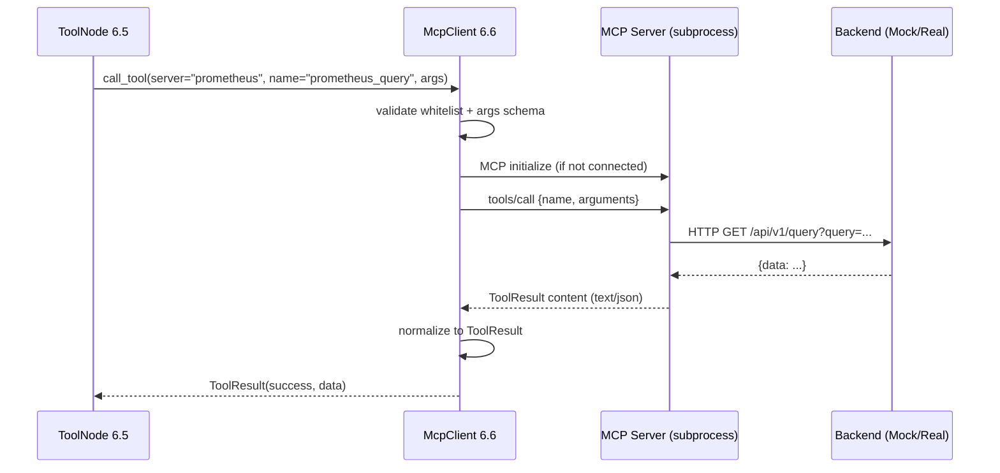
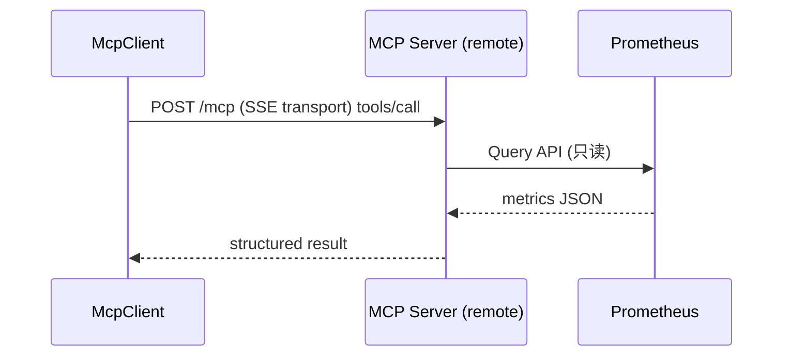
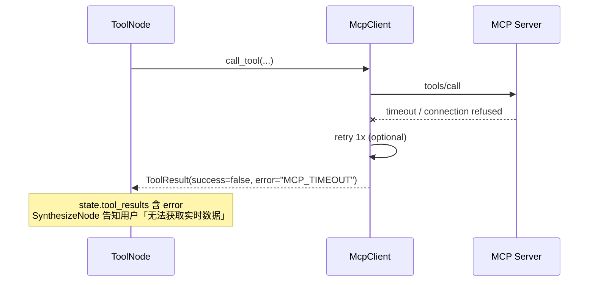

# 6.6 工具挂载模块 MCP（Python）

> 所属系统：DevOps AI Copilot — 智能面（Python AI Plane）  
> 模块定位：**外部系统能力的标准化接入层** — 以 MCP Client 调用 Prometheus、只读数据库等 Tool，为 LangGraph `ToolNode` 提供实时数据  
> 参考业界：Anthropic Model Context Protocol (MCP)、OpenAI Function Calling、LangChain Tools、Prometheus HTTP API

---

## 1. 功能背景与边界

### 1.1 功能背景

RAG 解决的是 **「历史知识」**（状态码字典、复盘文档），无法回答 **「此刻系统怎么样」**：

```text
「当前数据库连接数是否异常？」
「过去 5 分钟商品服务 P99 延迟多少？」
「只读查一下 pg_stat_activity 有多少条？」
```

这类问题需要 **实时、受控地访问外部系统**。若每个系统手写一套 HTTP 客户端，会导致：

- 接口风格不统一  
- 权限难以收口  
- Tool 难以扩展和审计  

**MCP（Model Context Protocol）** 把外部能力抽象成标准 **Tool**：`list_tools` / `call_tool`，由 **MCP Server** 托管具体实现，**MCP Client**（本模块）负责连接与调用。

在本项目中，6.5 `ToolNode` **不直接** 调 Prometheus/SQL，而是 **只调本模块的 `McpClient`**。

### 1.2 模块职责（In Scope）

| 能力 | 说明 |
|------|------|
| MCP Client 封装 | 连接一个或多个 MCP Server |
| Server 注册与配置 | 从 `agent_config.mcp_servers` 读取 |
| `list_tools` | 发现可用 Tool（启动时或按需） |
| `call_tool` | 执行 Tool 并规范化返回 |
| 超时与重试 | 单次调用 5s 超时，可配置 |
| 结果规范化 | 统一为 `ToolResult` 供 SynthesizeNode |
| Mock Server 适配 | MVP 本地 Mock Prometheus / 只读 SQL |
| 安全约束 | 仅白名单 Tool；参数校验；只读 |
| 错误降级 | 失败不抛崩整图，返回结构化 error |
| 日志与 Trace | tool 名、耗时、trace_id |

### 1.3 模块边界（Out of Scope）

| 不属于本模块 | 归属 |
|--------------|------|
| MCP Server 实现（业务侧） | 独立进程 / 官方 prometheus-mcp 等 |
| Tool 选路（用哪个 tool） | 6.5 ToolNode / Router |
| LLM Function Calling 自动选工具 | V1.1 |
| 写库、重启服务、发告警 | **禁止**；非只读运维 |
| Java 侧 Tool | 走 Java Internal API，不走 MCP |
| RAG 检索 | 6.4 |

### 1.4 在系统中的位置

```text
[6.5 ToolNode]
      │
      ▼
[6.6 McpClient] ──MCP 协议──► [MCP Server: prometheus-mock]
      │                    └──► [MCP Server: postgres-readonly-mock]
      │
      └──► 返回 ToolResult[] → state.tool_results → SynthesizeNode
```

### 1.5 MVP 与生产的 Server 规划

| Server 名 | MVP | 生产 |
|-----------|-----|------|
| `prometheus` | 本地 Mock，固定返回 `db_connections: 85` | 真实 Prometheus HTTP API（经 MCP Server 代理） |
| `postgres-readonly` | Mock 返回 `active_connections: 42` | 只读账号 + 白名单 SQL |

---

## 2. 流程图

### 2.1 业务流程图：Tool 调用总览

```text
┌──────────────┐
│ ToolNode     │
│ 收到 state   │
└──────┬───────┘
       ▼
┌──────────────┐
│ 解析用户意图  │
│ 映射 tool 名  │
└──────┬───────┘
       ▼
┌──────────────┐  未启用  ┌──────────────┐
│ agent.enable │────────►│ 跳过，空结果   │
│ _mcp?        │         └──────────────┘
└──────┬───────┘
       │是
       ▼
┌──────────────┐
│ McpClient    │
│ .call_tool() │
└──────┬───────┘
       ▼
┌──────────────┐  超时   ┌──────────────┐
│ MCP Server   │──────►│ ToolResult   │
│ 执行         │  失败  │ {error:...}  │
└──────┬───────┘         └──────────────┘
       │成功
       ▼
┌──────────────┐
│ 写入         │
│ tool_results │
└──────────────┘
```

### 2.2 业务流程图：MVP 关键词 → Tool 映射

```text
user_message
      │
      ├─ 含「连接数」「数据库连接」
      │     → server=prometheus, tool=prometheus_query
      │        args={query: "db_connections"}
      │
      ├─ 含「pg_stat」「会话数」「activity」
      │     → server=postgres-readonly, tool=readonly_sql
      │        args={sql: "SELECT count(*) FROM pg_stat_activity"}
      │
      └─ 其他 + enable_mcp
            → MVP: 不调 tool 或调 prometheus 默认 query
```

### 2.3 时序图：MCP 调用（stdio 模式 — MVP 常见）



### 2.4 时序图：MCP 调用（SSE/HTTP 模式 — 生产可选）



### 2.5 时序图：失败降级



---

## 3. 具体实现逻辑

### 3.1 技术栈总览

| 技术 | 用途 | 选型原因 |
|------|------|----------|
| **mcp Python SDK** (`mcp`) | 官方 MCP Client | 协议兼容；stdio/SSE  transport |
| **anyio / asyncio** | 异步子进程与 IO | 与 FastAPI 一致 |
| **pydantic** | Tool 参数校验 | 防注入、类型安全 |
| **httpx** | MCP HTTP transport / Mock backend | 异步 |
| **tenacity** | 重试 | 瞬时网络失败 |
| **structlog** | 审计日志 | tool 调用记录 |

**业界对照**：

| 方案 | 何时用 |
|------|--------|
| **MCP** | 多 Tool、多团队扩展、标准化宿主协议（2025–2026 趋势） |
| OpenAI Functions | 单 LLM 厂商、工具少 |
| 直连 Prometheus API | 最快 MVP，但不可扩展 |
| **本项目** | 架构要求 MCP；MVP 用 **Mock MCP Server** 验证全链路 |

**选型结论**：MVP **真走 MCP 协议**（哪怕 Server 是 Mock），避免以后从直连 refactor 到 MCP。

---

### 3.2 包结构建议

```text
ai_plane/app/mcp/
├── client/
│   ├── mcp_client.py           # 对外门面
│   ├── connection_pool.py      # 每 server 长连接
│   └── transports/
│       ├── stdio_transport.py
│       └── sse_transport.py    # V1
├── registry/
│   ├── server_config.py        # server 定义
│   └── tool_whitelist.py       # 允许的 tool 名
├── models/
│   ├── tool_result.py
│   └── tool_call_request.py
├── resolver/
│   └── keyword_tool_resolver.py  # MVP 意图→tool 映射
├── mock_servers/               # MVP 开发用
│   ├── prometheus_mock_server.py
│   └── postgres_mock_server.py
└── config.py
```

---

### 3.3 MCP Server 配置

#### 3.3.1 配置文件（`config.py` / YAML）

```yaml
mcp:
  servers:
    prometheus:
      transport: stdio
      command: python
      args: ["-m", "app.mcp.mock_servers.prometheus_mock_server"]
      enabled: true
      timeout_seconds: 5
    postgres-readonly:
      transport: stdio
      command: python
      args: ["-m", "app.mcp.mock_servers.postgres_mock_server"]
      enabled: true
      timeout_seconds: 5
```

生产示例：

```yaml
prometheus:
  transport: sse
  url: http://mcp-gateway:8081/mcp/prometheus
  headers:
    Authorization: Bearer ${MCP_PROM_TOKEN}
```

#### 3.3.2 与 Agent 配置联动

```python
# agent_config.mcp_servers = ["prometheus", "postgres-readonly"]
def get_active_servers(agent_config: dict) -> list[str]:
    allowed = set(settings.MCP_SERVERS.keys())
    requested = set(agent_config.get("mcp_servers") or [])
    return list(allowed & requested) if requested else list(allowed)
```

---

### 3.4 MCP Client 核心实现

#### 3.4.1 门面 API

```python
class McpClient:
    async def list_tools(self, server: str) -> list[ToolDescriptor]:
        session = await self.pool.get_session(server)
        tools = await session.list_tools()
        return [ToolDescriptor(name=t.name, description=t.description, input_schema=t.inputSchema) for t in tools.tools]

    async def call_tool(
        self,
        server: str,
        name: str,
        arguments: dict,
        trace_id: str | None = None,
    ) -> ToolResult:
        self.whitelist.ensure_allowed(server, name)
        self.validator.validate(server, name, arguments)

        start = time.perf_counter()
        try:
            session = await self.pool.get_session(server)
            result = await asyncio.wait_for(
                session.call_tool(name, arguments),
                timeout=self.config.timeout(server),
            )
            data = self._parse_content(result.content)
            return ToolResult(
                success=True,
                server=server,
                tool=name,
                data=data,
                latency_ms=int((time.perf_counter() - start) * 1000),
            )
        except asyncio.TimeoutError:
            return ToolResult(success=False, server=server, tool=name, error="MCP_TIMEOUT")
        except Exception as e:
            logger.exception("mcp_call_failed", server=server, tool=name, trace_id=trace_id)
            return ToolResult(success=False, server=server, tool=name, error=str(e)[:200])
```

#### 3.4.2 ToolResult 模型

```python
class ToolResult(BaseModel):
    success: bool
    server: str
    tool: str
    data: dict | list | str | None = None
    error: str | None = None
    latency_ms: int | None = None

    def to_prompt_text(self) -> str:
        if not self.success:
            return f"[Tool {self.tool} 失败: {self.error}]"
        return json.dumps(self.data, ensure_ascii=False)
```

供 6.5 `SynthesizeNode` 拼进 context。

#### 3.4.3 连接池（connection_pool.py）

```text
每个 MCP Server 维护一个长连接 Session：
  首次 call_tool → spawn subprocess (stdio) 或 connect SSE
  后续复用
  空闲 10min 关闭（MVP 可进程级单例）
```

**stdio 模式（MVP）**：

```python
from mcp import ClientSession, StdioServerParameters
from mcp.client.stdio import stdio_client

async def create_stdio_session(server_cfg) -> ClientSession:
    params = StdioServerParameters(command=server_cfg.command, args=server_cfg.args)
    read, write = await stdio_client(params)
    session = ClientSession(read, write)
    await session.initialize()
    return session
```

---

### 3.5 安全：白名单与参数校验

#### 3.5.1 Tool 白名单（tool_whitelist.py）

```python
WHITELIST = {
    "prometheus": {"prometheus_query", "prometheus_query_range"},
    "postgres-readonly": {"readonly_sql"},
}

def ensure_allowed(self, server: str, tool: str):
    if tool not in WHITELIST.get(server, set()):
        raise ToolNotAllowedError(f"{server}/{tool}")
```

**禁止** 动态执行用户提供的任意 tool 名。

#### 3.5.2 参数校验

**prometheus_query**

```python
class PromQueryArgs(BaseModel):
    query: str = Field(max_length=256)

    @field_validator("query")
    @classmethod
    def no_injection(cls, v: str):
        # MVP: 仅允许白名单 metric 名或预定义 query key
        if v not in ALLOWED_PROM_QUERIES and not PROMQL_SAFE_PATTERN.match(v):
            raise ValueError("query not allowed")
        return v

ALLOWED_PROM_QUERIES = {
    "db_connections",
    "service_p99_latency",
    "jvm_heap_used",
}
```

MVP：`query` **只允许枚举 key**，Server 内部映射到真实 PromQL。

**readonly_sql**

```python
class ReadonlySqlArgs(BaseModel):
    sql: str = Field(max_length=512)

    @field_validator("sql")
    @classmethod
    def select_only(cls, v: str):
        normalized = v.strip().lower()
        if not normalized.startswith("select"):
            raise ValueError("only SELECT allowed")
        if any(kw in normalized for kw in ["insert", "update", "delete", "drop", "alter", "truncate"]):
            raise ValueError("forbidden keyword")
        return v
```

生产：SQL **不下发给 LLM 自由生成**；MVP 用 **固定 SQL 模板** + 参数。

---

### 3.6 Mock MCP Server 实现（MVP）

#### 3.6.1 Prometheus Mock Server

```python
# prometheus_mock_server.py — 使用 mcp.server SDK
from mcp.server import Server
from mcp.types import Tool, TextContent

app = Server("prometheus-mock")

@app.list_tools()
async def list_tools():
    return [Tool(
        name="prometheus_query",
        description="Query instant prometheus metric by key",
        inputSchema={
            "type": "object",
            "properties": {"query": {"type": "string"}},
            "required": ["query"],
        },
    )]

@app.call_tool()
async def call_tool(name: str, arguments: dict):
    if name != "prometheus_query":
        raise ValueError("unknown tool")
    q = arguments.get("query")
    MOCK = {
        "db_connections": {"value": 85, "threshold": 100, "unit": "connections"},
        "service_p99_latency": {"value": 0.42, "unit": "seconds"},
    }
    data = MOCK.get(q, {"error": "unknown query key"})
    return [TextContent(type="text", text=json.dumps(data))]
```

#### 3.6.2 Postgres Readonly Mock Server

```python
@app.call_tool()
async def call_tool(name: str, arguments: dict):
    if name == "readonly_sql":
        # MVP: 忽略 SQL 细节，返回固定结构
        return [TextContent(type="text", text=json.dumps({
            "active_connections": 42,
            "max_connections": 200,
        }))]
```

**验收价值**：证明 **MCP 协议 + ToolNode + Synthesize** 全链路，无需真实内网。

---

### 3.7 与 6.5 ToolNode 集成

```python
# tool.py (6.5)
from app.mcp.resolver.keyword_tool_resolver import resolve_tool_calls

async def tool_node(state: DiagnosisState) -> DiagnosisState:
    if not state["agent_config"].get("enable_mcp"):
        state["tool_results"] = []
        return state

    calls = resolve_tool_calls(state["user_message"], state["agent_config"])
    results = []
    for call in calls:
        res = await mcp_client.call_tool(
            server=call.server,
            name=call.tool,
            arguments=call.arguments,
            trace_id=state["trace_id"],
        )
        results.append(res.model_dump())

    state["tool_results"] = results
    return state
```

#### keyword_tool_resolver.py（MVP）

```python
@dataclass
class ToolCallSpec:
    server: str
    tool: str
    arguments: dict

def resolve_tool_calls(user_message: str, agent_config: dict) -> list[ToolCallSpec]:
    servers = get_active_servers(agent_config)
    calls = []

    if "prometheus" in servers and re.search(r"连接数|CPU|QPS|延迟", user_message):
        if "连接数" in user_message:
            calls.append(ToolCallSpec("prometheus", "prometheus_query", {"query": "db_connections"}))
        elif "延迟" in user_message:
            calls.append(ToolCallSpec("prometheus", "prometheus_query", {"query": "service_p99_latency"}))

    if "postgres-readonly" in servers and re.search(r"pg_stat|activity|会话", user_message):
        calls.append(ToolCallSpec(
            "postgres-readonly", "readonly_sql",
            {"sql": "SELECT count(*) AS cnt FROM pg_stat_activity"},
        ))
    return calls
```

---

### 3.8 生产 Prometheus Server 设计要点（非 MVP，需记录差距）

```text
MCP Server (prometheus) 内部：
  1. 接收 query key 或预审批 PromQL
  2. 转发到 Prometheus HTTP API (只读)
  3. 结果裁剪（避免巨大 JSON 塞爆 context）
  4. 鉴权：Bearer token / mTLS
  5. 审计日志：谁查了什么
```

**不把 PromQL 完全交给 LLM 生成** — 企业安全实践。

---

### 3.9 结果裁剪与 Context 控制

```python
def trim_prometheus_result(data: dict, max_chars: int = 2000) -> dict:
    # 只保留关键字段；时序数据只保留最近 N 个点
    ...
```

**业界问题**：Tool 返回过大导致超 context；必须在 MCP Server 或 Client 裁剪。

---

### 3.10 可观测性（模块内）

| 指标 | 说明 |
|------|------|
| `mcp_tool_calls_total{server,tool,status}` | 调用次数 |
| `mcp_tool_latency_seconds{server,tool}` | 耗时 |
| `mcp_connection_errors_total{server}` | 连接失败 |

日志：

```json
{
  "event": "mcp.tool.call",
  "trace_id": "...",
  "server": "prometheus",
  "tool": "prometheus_query",
  "success": true,
  "latency_ms": 120,
  "args_redacted": {"query": "db_connections"}
}
```

**不记录** 完整 SQL/PromQL 若含敏感信息；MVP Mock 可记全量。

---

## 4. 可扩展方案

### 4.1 Server / Tool 扩展路线图

| 阶段 | 新增 Tool |
|------|-----------|
| MVP | prometheus_query, readonly_sql（Mock） |
| V1 | prometheus_query_range（时序） |
| V1 | elasticsearch_search（日志，只读） |
| V2 | kibana_mcp（若企业有） |
| V2 | k8s_readonly（pod 状态，只读） |
| V2 | 内部 CMDB 查询 |

新增步骤：

```text
1. 部署 MCP Server（独立进程）
2. config.yaml 注册 server
3. tool_whitelist.py 加 tool 名
4. keyword_resolver 或 LLM function calling 加映射
5. 黄金集测试
```

### 4.2 Tool 选路演进

| 阶段 | 方案 |
|------|------|
| MVP | 关键词 → 固定 ToolCallSpec |
| V1 | LLM function calling：`tools=list_tools()` 提供给模型 |
| V2 | 向量匹配历史「类似问题用过哪个 tool」 |

### 4.3 传输层扩展

| transport | 场景 |
|-----------|------|
| stdio | 本地子进程、开发 |
| SSE | 远程 MCP Gateway |
| 企业内部 MCP Gateway | 统一鉴权、审计 |

### 4.4 与 Java 的边界扩展

| 数据类型 | 推荐通道 |
|----------|----------|
| 实时指标 / 外部系统 | MCP（本模块） |
| 会话历史、analysis_job、权限数据 | Java Internal API |

**不要** 为读 session 再造 MCP Server — 除非全公司统一 MCP 治理。

---

## 5. MVP vs 生产：技术差距清单

| 能力 | MVP | 生产 | 风险 |
|------|-----|------|------|
| MCP Server | 本地 Mock 子进程 | 真实 Prometheus/DB 网关 | 演示与真实脱节 |
| Tool 选路 | 关键词规则 | LLM tools + 审批 | 覆盖不全 |
| PromQL/SQL | 枚举 key / 固定 SQL | 预审批模板库 | 注入攻击 |
| 鉴权 | 无 | MCP Gateway token + mTLS | 内网滥用 |
| 审计 | 日志 | 独立 audit 表 | 合规 |
| 连接管理 | 单进程长连接 | 池化 + 健康检查 | 泄漏子进程 |
| 超时 | 5s 固定 | 按 tool 分级 | 慢查询拖垮 |
| 结果大小 | Mock 很小 | 必须裁剪 | context 爆炸 |
| 高可用 | 单实例 | Server 多副本 | 单点 |
| 速率限制 | 无 | per-team tool 配额 | 打爆 Prometheus |
| 错误分类 | 字符串 | 标准 code + 可重试标记 | 排障难 |

---

## 6. 模块交付验收标准（MVP）

| # | 验收项 |
|---|--------|
| 1 | `list_tools("prometheus")` 返回 `prometheus_query` |
| 2 | `call_tool(prometheus, prometheus_query, {query: db_connections})` 返回 85 |
| 3 | 非白名单 tool 名被拒绝 |
| 4 | `readonly_sql` 含 `DELETE` 参数校验失败 |
| 5 | Server 超时返回 `ToolResult(success=false, error=MCP_TIMEOUT)` |
| 6 | ToolNode 集成后「当前连接数」回答含 85 |
| 7 | MCP 失败时 LLM 仍流式回复（降级），不断流 |
| 8 | 日志含 trace_id、server、tool、latency_ms |
| 9 | `enable_mcp=false` 时不启动 MCP 调用 |
| 10 | Mock Server 随 `docker compose up` 可拉起（或由 AI Plane spawn） |

---

## 7. 与其他模块的接口约定

| 模块 | 交互 |
|------|------|
| 6.5 | `McpClient.call_tool()` 由 `tool_node` 调用；结果写入 `state.tool_results` |
| 6.5 Synthesize | `ToolResult.to_prompt_text()` 进 prompt |
| 6.2 | tool 结果最终进 `messages.metadata_json.toolCalls`（Java 侧） |
| 6.7 | metrics + span `mcp.call_tool` |
| 6.4 | 无交集；知识走 RAG 非 MCP |

---

## 8. Docker Compose 中的部署方式（建议）

**方式 A（MVP 推荐）**：AI Plane 进程内 **stdio spawn** Mock Server，无需单独容器。

**方式 B（V1）**：独立服务

```text
services:
  mcp-prometheus:
    image: your/mcp-prometheus:latest
    environment:
      PROMETHEUS_URL: http://prometheus:9090
  ai-plane:
    environment:
      MCP_PROMETHEUS_URL: http://mcp-prometheus:8081/sse
```

---

## 9. 安全清单（必须遵守）

| # | 规则 |
|---|------|
| 1 | 仅白名单 Tool 可调用 |
| 2 | 禁止写操作类 Tool |
| 3 | 用户自然语言 **不直接** 作为 SQL/PromQL 执行 |
| 4 | MCP Server 跑在内网，不对公网暴露 |
| 5 | 敏感结果进 LLM 前裁剪 |
| 6 | 所有调用带 trace_id 可审计 |

---

**6.6 工具挂载模块 MCP（Python）** 已全部细化完毕。
