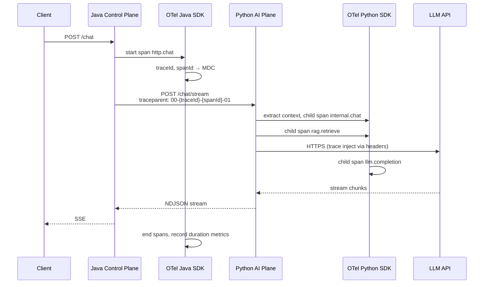
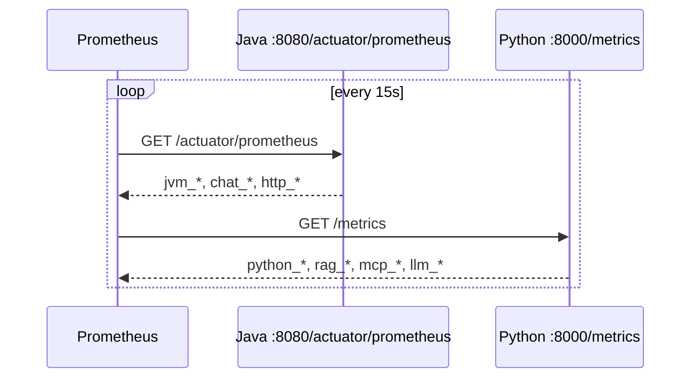
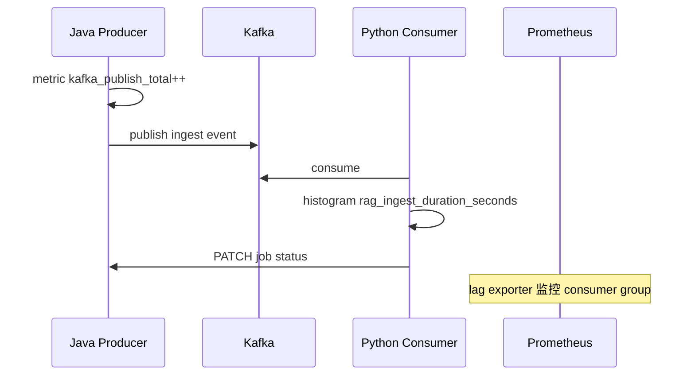

# 6.7 遥测监控模块（Observability）

> 所属系统：DevOps AI Copilot — **横切全栈**（Java 控制面 + Python 智能面 + 中间件）  
> 模块定位：让系统 **可观测、可排障、可量化** — 统一 Trace ID、指标、日志，回答「昨天 15:00 聊天为什么变慢」  
> 参考业界：Google SRE 三大信号（Metrics / Logs / Traces）、OpenTelemetry 标准、Prometheus + Grafana 栈、Spring Boot Actuator、LGTM 栈（Loki/Grafana/Tempo/Mimir）简化版

---

## 1. 功能背景与边界

### 1.1 功能背景

本系统是 **跨语言双栈 + 多中间件** 架构：

```text
Client → Java → Python → LLM / MCP / pgvector
              ↓
         Redis / Kafka / PostgreSQL / MinIO
```

出问题时典型疑问：

| 问题 | 需要的能力 |
|------|------------|
| 聊天接口 P99 变慢 | **Metrics**：延迟分位数 |
| 慢在哪个环节 | **Traces**：Java → Python → LLM 分段耗时 |
| 某次失败原因 | **Logs**：同一 traceId 串起全链路 |
| Kafka 积压 | **Metrics**：consumer lag |
| JVM / 内存问题 | **Metrics**：JVM、GC |

没有遥测 = 只能猜。本模块是 **工程能力训练的核心一环**，也是 DevOps 岗位与 AI 平台岗的共性要求。

### 1.2 模块职责（In Scope）

| 支柱 | 能力 |
|------|------|
| **Metrics** | Micrometer → Prometheus；Python prometheus_client |
| **Traces** | OpenTelemetry SDK；W3C traceparent 透传 |
| **Logs** | 结构化 JSON；traceId / spanId 注入 MDC |
| **Dashboard** | Grafana 大盘（聊天、JVM、ingest、LLM） |
| **告警规则（MVP 文档级）** | 关键阈值定义；生产接 Alertmanager |
| **排障手册** | Postmortem 模板与标准查询路径 |

### 1.3 模块边界（Out of Scope）

| 不属于本模块 | 说明 |
|--------------|------|
| 业务功能 | 各模块埋点，本模块定 **规范与基础设施** |
| 完整 APM 商业产品 | Datadog/New Relic 级 |
| 日志长期存储 Loki/ES | MVP 用容器日志 + 文件；V1 Loki |
| 真实告警 On-call PagerDuty | V2 |
| 安全 SIEM | 超出范围 |
| LLM 质量评估平台 | LangSmith 类；V2 |

### 1.4 在系统中的位置（三大信号）

```text
┌─────────────────────────────────────────────────────────┐
│                    Application Layer                     │
│  Java (6.1~6.3)          Python (6.4~6.6)              │
│     │ metrics/traces/logs      │ metrics/traces/logs    │
└─────┼──────────────────────────┼────────────────────────┘
      │         traceparent       │
      └────────────┬──────────────┘
                   ▼
┌──────────────────────────────────────────────────────────┐
│              OpenTelemetry Collector (可选 MVP 跳过)      │
│              或直连 Exporter                              │
└────────────┬─────────────────────┬───────────────────────┘
             ▼                     ▼
      ┌─────────────┐       ┌─────────────┐
      │ Prometheus  │       │ Tempo/Jaeger │  (Traces, V1)
      │  (Metrics)  │       │  or OTel only│
      └──────┬──────┘       └─────────────┘
             ▼
      ┌─────────────┐
      │  Grafana    │
      └─────────────┘
```

### 1.5 MVP 最小可观测闭环

```text
MVP 必须交付：
  1. 全链路 traceId（日志可关联）
  2. Prometheus 抓取 Java + Python 核心指标
  3. Grafana 至少 1 个 Dashboard
  4. 能完成一次「慢请求」人工排障演练

MVP 可延后：
  - OTel Collector 独立部署
  - 分布式 Trace 可视化（Jaeger UI）
  - 自动告警
```

---

## 2. 流程图

### 2.1 业务流程图：一次请求的观测数据流

```text
┌──────────────┐
│ Client 请求   │
└──────┬───────┘
       ▼
┌──────────────┐
│ Java TraceId │──► MDC.traceId
│ Filter       │──► OTel root span: http.server
└──────┬───────┘
       ▼
┌──────────────┐
│ 业务处理      │──► metrics: chat_requests_total++
│              │──► logs: JSON {traceId, event}
└──────┬───────┘
       ▼
┌──────────────┐
│ WebClient    │──► inject traceparent
│ → Python     │──► child span: http.client
└──────┬───────┘
       ▼
┌──────────────┐
│ Python       │──► extract traceparent, child spans
│ LangGraph    │    graph.router / rag.retrieve / llm.stream
└──────┬───────┘
       ▼
┌──────────────┐
│ LLM / MCP    │──► span: llm.chat / mcp.tool
└──────┬───────┘
       ▼
┌──────────────┐
│ Prometheus   │◄── scrape /actuator/prometheus
│ scrape       │◄── scrape python :8000/metrics
└──────┬───────┘
       ▼
┌──────────────┐
│ Grafana 展示  │
└─────────────┘
```

### 2.2 业务流程图：标准排障路径（验收场景）

```text
「昨天 15:00 聊天变慢」
        │
        ▼
┌───────────────────┐
│ Grafana: chat P99  │ 是否升高？
└─────────┬─────────┘
          │是
          ▼
┌───────────────────┐
│ 同时间段 error 率？ │ LLM 超时？ 429？
└─────────┬─────────┘
          ▼
┌───────────────────┐
│ JVM / DB 连接池？   │
└─────────┬─────────┘
          ▼
┌───────────────────┐
│ 抽样慢 traceId     │ (MVP: 日志搜 traceId + 分段耗时日志)
│ Java vs Python vs  │
│ LLM TTFB           │
└─────────┬─────────┘
          ▼
┌───────────────────┐
│ 结论写入 Postmortem │
└───────────────────┘
```

### 2.3 时序图：Trace 上下文传播（聊天链路）



### 2.4 时序图：Prometheus 抓取



### 2.5 时序图：异步 Ingest 的可观测



---

## 3. 具体实现逻辑

### 3.1 技术栈总览

| 组件 | Java | Python | 选型原因 |
|------|------|--------|----------|
| **指标** | Micrometer + `micrometer-registry-prometheus` | `prometheus-client` | 云原生事实标准 |
| **指标存储** | Prometheus | 同 | Pull 模型简单，适合 MVP |
| **可视化** | Grafana | 同 | 与 Prometheus 配套 |
| **链路** | OpenTelemetry Java Agent 或 SDK | `opentelemetry-sdk` + `opentelemetry-instrumentation` | 厂商中立标准 |
| **日志** | Logback + `logstash-logback-encoder` | `structlog` | JSON 便于 Loki/ES |
| **关联** | MDC `traceId` | contextvars | 日志与 Trace 串联 |
| **JVM** | Actuator `jvm.*` | — | 内置 |
| **中间件** | OTel JDBC/Redis/Kafka 自动埋点（V1） | aiokafka instrumentation | 减少手写 |

**业界对照**：

| 方案 | 特点 |
|------|------|
| ELK + APM | 重，适合大厂已有 |
| **Prometheus + Grafana + OTel** | 2026 主流开源组合 |
| 仅日志 | MVP 最低配，不够回答 P99 |
| **本项目 MVP** | Metrics + JSON 日志 + traceId；Trace UI 可 V1 |

---

### 3.2 统一约定（全项目必须遵守）

#### 3.2.1 标识符

| 字段 | 生成点 | 传播方式 |
|------|--------|----------|
| `traceId` | Java `TraceIdFilter`（入口） | HTTP header `X-Trace-Id` + W3C `traceparent` |
| `spanId` | 各层 OTel SDK | `traceparent` |
| `sessionId` | 业务 | 日志字段，非 Trace 必需 |
| `userId` | JWT | 日志字段（脱敏策略） |

#### 3.2.2 W3C traceparent 格式

```text
traceparent: 00-{traceId}-{parentSpanId}-{flags}
```

Java WebClient 出站：

```java
TextMapPropagator propagator = openTelemetry.getPropagators().getTextMapPropagator();
propagator.inject(Context.current(), request, (carrier, key, value) -> carrier.set(key, value));
```

Python FastAPI 入站：

```python
from opentelemetry.propagate import extract
ctx = extract(request.headers)
with tracer.start_as_current_span("internal.chat", context=ctx):
    ...
```

#### 3.2.3 日志 JSON Schema（双栈统一）

```json
{
  "timestamp": "2026-07-07T09:00:00.123Z",
  "level": "INFO",
  "service": "control-plane",
  "traceId": "4bf92f3577b34da6",
  "spanId": "00f067aa0ba902b7",
  "userId": 1001,
  "sessionId": "uuid",
  "event": "chat.stream.start",
  "message": "chat stream started",
  "durationMs": null,
  "extra": {}
}
```

| 规则 | 说明 |
|------|------|
| `event` | 机器可读事件名，snake 点分 |
| `message` | 人类可读简述 |
| 禁止 | 打印完整 prompt / API Key |
| 允许 | token 用量数字、chunk 数量 |

---

### 3.3 Java 侧实现

#### 3.3.1 包结构

```text
com.devops.copilot.observability
├── config/
│   ├── OpenTelemetryConfig.java
│   ├── MetricsConfig.java
│   └── LoggingMdcConfig.java
├── filter/
│   └── TraceIdFilter.java
├── metrics/
│   ├── ChatMetrics.java
│   ├── IngestMetrics.java
│   └── BusinessMetricsRegistrar.java
└── logging/
    └── MdcKeys.java
```

#### 3.3.2 TraceIdFilter（与 6.1 衔接，可合并）

```java
@Component
@Order(Ordered.HIGHEST_PRECEDENCE)
public class TraceIdFilter extends OncePerRequestFilter {
    @Override
    protected void doFilterInternal(HttpServletRequest req, HttpServletResponse res, FilterChain chain) {
        String traceId = extractOrGenerate(req.getHeader("traceparent"), req.getHeader("X-Trace-Id"));
        MDC.put("traceId", traceId);
        res.setHeader("X-Trace-Id", traceId);
        try (Scope scope = span.makeCurrent()) {
            chain.doFilter(req, res);
        } finally {
            MDC.clear();
        }
    }
}
```

#### 3.3.3 Spring Boot Actuator + Prometheus

```yaml
management:
  endpoints:
    web:
      exposure:
        include: health,prometheus,metrics
  metrics:
    tags:
      application: control-plane
    distribution:
      percentiles-histogram:
        http.server.requests: true
        chat.stream.duration: true
```

依赖：

```xml
<dependency>
  <groupId>io.micrometer</groupId>
  <artifactId>micrometer-registry-prometheus</artifactId>
</dependency>
```

#### 3.3.4 自定义业务指标（ChatMetrics）

```java
@Component
public class ChatMetrics {
    private final Counter chatRequests;
    private final Timer chatStreamDuration;
    private final Counter chatErrors;

    public ChatMetrics(MeterRegistry registry) {
        chatRequests = Counter.builder("chat.requests.total")
            .tag("application", "control-plane")
            .register(registry);
        chatStreamDuration = Timer.builder("chat.stream.duration")
            .publishPercentiles(0.5, 0.95, 0.99)
            .register(registry);
        chatErrors = Counter.builder("chat.errors.total")
            .register(registry);
    }

    public void recordSuccess(long durationMs) {
        chatRequests.increment();
        chatStreamDuration.record(durationMs, TimeUnit.MILLISECONDS);
    }

    public void recordError(String code) {
        chatErrors.increment();
        Counter.builder("chat.errors.total").tag("code", code).register(registry).increment();
    }
}
```

#### 3.3.5 WebClient 观测

```java
@Bean
WebClient aiPlaneWebClient(OpenTelemetry otel, ChatMetrics metrics) {
    return WebClient.builder()
        .filter((req, next) -> {
            long start = System.currentTimeMillis();
            return next.exchange(req).doOnTerminate(() -> {
                metrics.recordAiPlaneCall(System.currentTimeMillis() - start);
            });
        })
        .clientConnector(new ReactorClientHttpConnector(
            HttpClient.create().responseTimeout(Duration.ofSeconds(120))))
        .build();
}
```

V1：使用 `OpenTelemetryInstrumentation` 自动创建 `http.client` span。

#### 3.3.6 关键埋点位置（Java）

| 位置 | event / metric |
|------|----------------|
| AuthController login | `auth.login.success/fail` |
| RateLimitFilter | `rate_limit.blocked` |
| ChatService 开始/结束 | `chat.stream.start/end`, `chat.stream.duration` |
| File upload | `upload.duration`, `upload.bytes` |
| Kafka publish | `kafka.publish.total`, `kafka.publish.failures` |
| GlobalExceptionHandler | `http.errors` + log `traceId` |

---

### 3.4 Python 侧实现

#### 3.4.1 包结构

```text
ai_plane/app/observability/
├── otel.py              # TracerProvider 初始化
├── metrics.py           # Prometheus metrics 定义
├── logging.py           # structlog 配置
├── middleware.py        # FastAPI trace + request metrics
└── decorators.py        # span 装饰器
```

#### 3.4.2 OpenTelemetry 初始化（otel.py）

```python
from opentelemetry import trace
from opentelemetry.sdk.trace import TracerProvider
from opentelemetry.sdk.trace.export import BatchSpanProcessor
from opentelemetry.exporter.otlp.proto.grpc.trace_exporter import OTLPSpanExporter
from opentelemetry.instrumentation.fastapi import FastAPIInstrumentor
from opentelemetry.instrumentation.httpx import HTTPXClientInstrumentor

def setup_otel(app, service_name="ai-plane"):
    provider = TracerProvider(resource=Resource.create({"service.name": service_name}))
    # MVP: 可先用 ConsoleSpanExporter 或 Noop
    if settings.OTEL_EXPORTER_OTLP_ENDPOINT:
        provider.add_span_processor(BatchSpanProcessor(OTLPSpanExporter()))
    trace.set_tracer_provider(provider)
    FastAPIInstrumentor.instrument_app(app)
    HTTPXClientInstrumentor().instrument()
```

**MVP 简化**：若无 OTLP Collector，**仍初始化 Tracer**，span 写入日志（`LoggingSpanExporter`）或仅生成 spanId 供日志关联。

#### 3.4.3 Prometheus metrics（metrics.py）

```python
from prometheus_client import Counter, Histogram, generate_latest

CHAT_STREAM_DURATION = Histogram(
    "chat_stream_duration_seconds", "AI plane chat stream duration",
    buckets=[0.5, 1, 2, 5, 10, 30, 60, 120],
)
RAG_RETRIEVAL_LATENCY = Histogram("rag_retrieval_latency_seconds", "RAG retrieval")
MCP_TOOL_LATENCY = Histogram("mcp_tool_latency_seconds", "MCP tool call", ["server", "tool"])
LLM_TTFB = Histogram("llm_time_to_first_token_seconds", "LLM TTFB")
INGEST_DURATION = Histogram("rag_ingest_duration_seconds", "Ingest job duration")
INGEST_FAILURES = Counter("rag_ingest_failures_total", "Ingest failures", ["reason"])

@app.get("/metrics")
def metrics():
    return Response(generate_latest(), media_type="text/plain; version=0.0.4")
```

#### 3.4.4 structlog 配置

```python
import structlog

def configure_logging():
    structlog.configure(
        processors=[
            structlog.contextvars.merge_contextvars,
            structlog.processors.add_log_level,
            structlog.processors.TimeStamper(fmt="iso"),
            inject_trace_context,  # 自定义：从 OTel 取 traceId/spanId
            structlog.processors.JSONRenderer(),
        ],
    )
```

#### 3.4.5 关键埋点位置（Python）

| 位置 | span name | metrics / log event |
|------|-----------|---------------------|
| `/internal/v1/chat/stream` | `internal.chat` | `chat_stream_duration_seconds` |
| router_node | `graph.router` | log `intent` |
| retrieve_node | `rag.retrieve` | `rag_retrieval_latency_seconds` |
| tool_node / McpClient | `mcp.tool` | `mcp_tool_latency_seconds` |
| LLM stream 首 token | `llm.completion` | `llm_time_to_first_token_seconds` |
| Ingest consumer | `ingest.process` | `rag_ingest_duration_seconds` |

示例：

```python
tracer = trace.get_tracer(__name__)

async def retrieve_node(state):
    with tracer.start_as_current_span("rag.retrieve") as span:
        start = time.perf_counter()
        hits = await retriever.retrieve(...)
        span.set_attribute("rag.hits", len(hits))
        RAG_RETRIEVAL_LATENCY.observe(time.perf_counter() - start)
        logger.info("rag.retrieve.done", hits=len(hits), intent=state.get("intent"))
        ...
```

---

### 3.5 Prometheus 配置

#### 3.5.1 scrape 配置（`prometheus.yml`）

```yaml
global:
  scrape_interval: 15s

scrape_configs:
  - job_name: control-plane
    metrics_path: /actuator/prometheus
    static_configs:
      - targets: ['control-plane:8080']

  - job_name: ai-plane
    metrics_path: /metrics
    static_configs:
      - targets: ['ai-plane:8000']

  # V1: kafka-exporter, redis-exporter, postgres-exporter
```

#### 3.5.2 核心指标清单（全系统）

| 指标名 | 类型 | 来源 | 用途 |
|--------|------|------|------|
| `chat_requests_total` | Counter | Java | 流量 |
| `chat_stream_duration_seconds` | Histogram | Java | 端到端延迟（含 SSE） |
| `chat_errors_total{code}` | Counter | Java | 错误率 |
| `http_server_requests_seconds` | Histogram | Java Actuator | 通用 API |
| `jvm_memory_used_bytes` | Gauge | Java | OOM 排查 |
| `hikaricp_connections_active` | Gauge | Java | DB 池耗尽 |
| `kafka_publish_failures_total` | Counter | Java | 投递失败 |
| `chat_stream_duration_seconds` | Histogram | Python | AI 侧耗时 |
| `rag_retrieval_latency_seconds` | Histogram | Python | RAG 慢 |
| `mcp_tool_latency_seconds` | Histogram | Python | MCP 慢 |
| `llm_time_to_first_token_seconds` | Histogram | Python | 模型冷启动/排队 |
| `rag_ingest_duration_seconds` | Histogram | Python | 入库慢 |
| `rag_ingest_failures_total` | Counter | Python | 入库失败 |

---

### 3.6 Grafana Dashboard 设计

#### 3.6.1 MVP：单 Dashboard「DevOps AI Copilot Overview」

**Row 1 — 黄金信号（聊天）**

| Panel | PromQL 示例 |
|-------|-------------|
| Chat QPS | `rate(chat_requests_total[5m])` |
| Chat P50/P95/P99 | `histogram_quantile(0.99, rate(chat_stream_duration_seconds_bucket[5m]))` |
| Error Rate | `rate(chat_errors_total[5m]) / rate(chat_requests_total[5m])` |

**Row 2 — 分段延迟（定位瓶颈）**

| Panel | 说明 |
|-------|------|
| Java chat stream duration P99 | 端到端 |
| Python chat stream duration P99 | AI 平面 |
| RAG retrieval P99 | 检索 |
| LLM TTFB P99 | 模型首 token |
| MCP tool P99 | 外部工具 |

**Row 3 — 资源**

| Panel | PromQL |
|-------|--------|
| JVM Heap | `jvm_memory_used_bytes{area="heap"}` |
| DB 连接池 | `hikaricp_connections_active` |
| Ingest 失败率 | `rate(rag_ingest_failures_total[5m])` |

#### 3.6.2 变量（Template variables）

```text
$datasource = Prometheus
$interval = 5m
```

V1 加 `$service`、`$instance`。

---

### 3.7 日志排障（MVP 无 Jaeger 时的主力）

#### 3.7.1 从用户报障到 traceId

```text
1. 用户提供大致时间 + userId / sessionId
2. Grafana/Loki 或 docker logs 搜索：
     sessionId="xxx" AND event="chat.stream.end"
3. 取出 traceId
4. 搜索全服务：
     traceId="4bf92f3577b34da6"
```

#### 3.7.2 分段耗时日志（推荐各模块打一条 summary）

Java `ChatService` 结束：

```json
{
  "event": "chat.stream.end",
  "traceId": "...",
  "sessionId": "...",
  "durationMs": 5200,
  "extra": {
    "aiPlaneMs": 4800,
    "tokenCount": 340,
    "status": "success"
  }
}
```

Python 结束：

```json
{
  "event": "chat.stream.end",
  "traceId": "...",
  "durationMs": 4700,
  "extra": {
    "intent": "rag",
    "ragMs": 180,
    "mcpMs": 0,
    "llmTtfbMs": 890,
    "llmTotalMs": 4200
  }
}
```

**MVP 无 Trace UI 时**，靠这两条 log 即可回答「慢在 RAG 还是 LLM」。

---

### 3.8 故障演练与 Postmortem（Week 11 验收）

#### 3.8.1 演练清单

| 注入故障 | 预期观测 |
|----------|----------|
| 停 Redis | `rate_limit` 异常或连接错误日志；chat 仍可能工作（若限流降级） |
| 重启 PostgreSQL | `hikaricp` 错误；`chat.errors` 上升 |
| 停 Kafka | `kafka_publish_failures`；ingest PENDING 卡住 |
| LLM 超时 | `llm_time_to_first_token` 飙高；`chat.errors{code=LLM_TIMEOUT}` |
| 打满线程池 | Tomcat `threads.busy`；HTTP 503 |

#### 3.8.2 Postmortem 模板

```markdown
# 事故标题
- 时间：
- 影响：
- traceId 样例：

## 时间线
## 根因（Metrics/Logs 证据）
## 为何未发现
## 修复动作
## 跟进项（告警/熔断/超时调整）
```

---

### 3.9 Docker Compose 可观测服务

```yaml
services:
  prometheus:
    image: prom/prometheus:v2.53.0
    volumes:
      - ./deploy/prometheus/prometheus.yml:/etc/prometheus/prometheus.yml
    ports: ["9090:9090"]

  grafana:
    image: grafana/grafana:11.0.0
    environment:
      GF_SECURITY_ADMIN_PASSWORD: admin
    volumes:
      - ./deploy/grafana/dashboards:/etc/grafana/provisioning/dashboards
      - ./deploy/grafana/datasources:/etc/grafana/provisioning/datasources
    ports: ["3000:3000"]

  # V1
  # jaeger:
  #   image: jaegertracing/all-in-one
  # otel-collector:
  #   image: otel/opentelemetry-collector
```

Grafana datasource 自动指向 `http://prometheus:9090`。

---

## 4. 可扩展方案

### 4.1 三支柱演进路线

```text
MVP     V1              V2
─────────────────────────────────────────
Metrics Prometheus  + exporters   + Mimir 长期存储
Logs    JSON stdout   Loki          + 保留策略
Traces  traceId日志   Jaeger/Tempo  + 采样策略
Alerts  文档阈值      Alertmanager  + PagerDuty
```

### 4.2 OpenTelemetry Collector（V1）

```text
Apps → OTLP → Collector → Prometheus (metrics)
                        → Tempo (traces)
                        → Loki (logs via filelog)
```

好处：应用只对接 Collector；导出器可换。

### 4.3 采样策略（生产必做）

| 场景 | 策略 |
|------|------|
| 全量 Trace | 成本高 |
| 生产推荐 | 1–10% 概率采样 + 错误 100% 采样 |
| 慢请求 | duration > 5s 强制保留 |

```python
from opentelemetry.sdk.trace.sampling import ParentBased, TraceIdRatioBased
sampler = ParentBased(root=TraceIdRatioBased(0.1))
```

### 4.4 告警规则示例（V1 Alertmanager）

```yaml
groups:
  - name: chat
    rules:
      - alert: ChatHighP99
        expr: histogram_quantile(0.99, rate(chat_stream_duration_seconds_bucket[5m])) > 10
        for: 5m
        labels: { severity: warning }
        annotations:
          summary: "Chat P99 > 10s"
      - alert: IngestFailureSpike
        expr: rate(rag_ingest_failures_total[10m]) > 0.1
```

### 4.5 SLO 定义（扩展）

| SLI | SLO 示例 |
|-----|----------|
| Chat 可用性 | 99.5% 非 5xx |
| Chat P95 延迟 | < 8s（含 LLM） |
| Ingest 成功率 | 99% 24h 内 COMPLETED |

Grafana SLO dashboard + error budget burn rate（V2）。

### 4.6 中间件 Exporter

| 组件 | Exporter |
|------|----------|
| Kafka | kafka-exporter |
| Redis | redis-exporter |
| PostgreSQL | postgres-exporter |
| MinIO | 自带 `/minio/v2/metrics/cluster` |

---

## 5. MVP vs 生产：技术差距清单

| 能力 | MVP | 生产 | 风险 |
|------|-----|------|------|
| Trace 可视化 | 日志 traceId 关联 | Jaeger/Tempo + Grafana Trace | 排障慢 |
| OTel 导出 | Logging/Noop | OTLP → Collector | 无分布式图 |
| 采样 | 100%（低流量） | 比例采样 + 慢请求保留 | 成本/存储 |
| 日志存储 | docker logs | Loki/ELK 集中化 | 日志丢失 |
| 告警 | 人工看 Grafana | Alertmanager 自动通知 | 故障滞后 |
| Dashboard | 1 个总览 | 分角色：SRE/业务/LLM 成本 | 信息过载 |
| 密钥 | 日志禁打 | 自动脱敏 scanner | 泄漏 |
| LLM 可观测 | TTFB 指标 | Token 成本/dashboard | 成本失控 |
| 多环境 | 单 compose | dev/staging/prod 标签隔离 | 数据混淆 |
| Actuator 安全 | prometheus 可能公开 | 内网 + auth | 信息泄漏 |
| Correlation | 部分手工 | 全链路自动 span parent | 断链 |
| Postmortem | 文档演练 | 制度化 on-call | 重复事故 |

---

## 6. 模块交付验收标准（MVP）

| # | 验收项 |
|---|--------|
| 1 | 任意 API 响应头含 `X-Trace-Id` |
| 2 | Java 日志 JSON 含 `traceId` |
| 3 | Python 日志 JSON 含 `traceId`（与 Java 一致） |
| 4 | Prometheus 能 scrape 两个 target |
| 5 | Grafana Dashboard 显示 Chat QPS 与 P99 |
| 6 | 一次慢请求能从日志分解 `ragMs` / `llmTtfbMs` |
| 7 | `chat.errors_total` 在 LLM 超时时增加 |
| 8 | ingest 完成有 `rag_ingest_duration_seconds` 记录 |
| 9 | 完成至少 1 份 Postmortem 演练文档 |
| 10 | 错误响应 body 含 `traceId`（6.1 与 6.7 联动） |

---

## 7. 与其他模块的埋点契约

| 模块 | 必须提供的观测点 |
|------|------------------|
| 6.1 | `auth.*`, `rate_limit.blocked`, Filter trace 根 |
| 6.2 | `chat.stream.*`, WebClient 耗时, SSE 并发 |
| 6.3 | `upload.*`, `kafka.publish.*`, ingest 补偿 Job 指标 |
| 6.4 | `rag.ingest.*`, `rag.retrieval.*` |
| 6.5 | `graph.*`, `llm.*`, intent 日志字段 |
| 6.6 | `mcp.tool.*`, tool 成败与延迟 |
| 6.8 | `analysis.ingest.*`, `analysis.duration_seconds` |

**原则**：业务模块 **只负责埋点**；本模块定义 **命名规范、Dashboard、排障路径**。

---

## 8. 指标与日志命名规范（摘要）

```text
Metrics:  小写 + 下划线，单位后缀 _seconds _bytes _total
Logs:     event 用 dot.case，如 chat.stream.end
Labels:   低基数（code, intent, server, tool）— 禁止 userId 作 metric label（高基数）
Traces:   span 名用名词.动词，如 rag.retrieve, llm.completion
```

---

## 9. 收束：6.7 在整体架构中的价值

```text
没有 6.7：
  功能能跑，出问题只能 println 猜

有了 6.7 MVP：
  Metrics 告诉「慢了多少」
  Logs + traceId 告诉「慢在哪一段」
  Grafana 告诉「何时开始慢」
  Postmortem 证明「工程化思维」

与训练目标对齐：
  这是从 Demo 到「可上线系统」的分水岭
```

---

**6.7 遥测监控模块** 已全部细化完毕。

---

## 全模块设计书索引（6.1 ~ 6.8 已完成）

| 章节 | 模块 |
|------|------|
| 6.1 | 网关与安全（Java） |
| 6.2 | 会话与元数据（Java） |
| 6.3 | 文件与调度（Java） |
| 6.4 | 知识检索 RAG（Python） |
| 6.5 | 智能体编排 LangGraph（Python） |
| 6.6 | 工具挂载 MCP（Python） |
| 6.7 | 遥测监控（全栈） |
| 6.8 | 大文件分析 Analysis Worker（Python） |

若你需要下一步，我可以：

1. **合并为一份《模块设计书目录 + 跨模块接口总表》**  
2. **补充附录：全量 Prometheus 指标清单 + Grafana JSON 面板说明**  
3. **补充附录：12 周实施时各模块依赖关系图**  

回复你需要的编号或关键词即可。